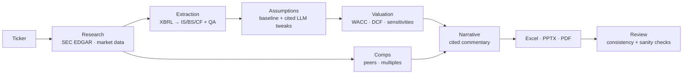

# IB Analyst Agent

> **Status (2026-09-30): early development.** The SEC EDGAR research path and financial statement extraction are implemented. `ib-agent fetch` resolves a ticker, screens financial-sector companies, retrieves company facts and recent filings, and caches responses. `ib-agent extract` builds the income statement, balance sheet, and cash flow statement (fiscal years + LTM) from XBRL and runs QA checks. Valuation, Excel, deck, and API generation are planned but not implemented yet. See [HOW_TO_RUN.md](HOW_TO_RUN.md) to run it and [implementation.md](implementation.md) for the verified status and phased plan.

The planned end state is a ticker-in, valuation package producing what a junior investment banking analyst would spend a weekend building:

- **`model.xlsx`**: a live-formula DCF model (Inputs → Historicals → Forecast → WACC → DCF → Sensitivity → Comps → Checks).
- **`deck.pptx` / `deck.pdf`**: a preliminary valuation pitch deck with a football field, sensitivity tables, trading comps, and cited commentary.
- **`run_manifest.json`**: a full audit trail showing where every number came from (SEC accession number, XBRL tag, period), the assumptions used, and every LLM call.

## How It Works



**Design rule: numbers come from code, words come from the LLM.** Financials come from SEC XBRL data and are valued with deterministic Python. The LLM summarizes 10-K sections, suggests assumption adjustments (bounded, with citations), proposes peers (then validated), and writes slide text. Every number in generated text is checked against the model. Every citation is checked against the filing.

## Features (planned)

- **SEC EDGAR ingestion:** ticker → CIK, company facts (XBRL), and 10-K / 10-Q documents. Rate-limited and cached, following SEC fair-access rules.
- **Three-statement extraction:** tag-fallback mapping, restatement handling, LTM roll-forward, and QA checks (balance sheet balances, cash-flow tie-out, required items).
- **DCF:** UFCF forecast, CAPM WACC with a regression beta (Blume-adjusted), Gordon growth and exit-multiple terminal values, mid-year convention, EV → equity bridge, and cross-check implied metrics.
- **Sensitivities:** implied share price across WACC × terminal growth and WACC × exit multiple.
- **Trading comps:** EV/Revenue, EV/EBITDA, and P/E with percentile statistics and implied valuation ranges.
- **Banker-style Excel:** blue inputs, black formulas, green links, named ranges, and a Checks sheet. The formulas are recalculated in LibreOffice and verified against the Python engine.
- **Pitch deck:** native, editable PowerPoint charts, a football field, and sourced footnotes. Converted to PDF.
- **Human in the loop:** `--review` pauses so you can edit `assumptions.yaml` before valuation.
- **LLM-optional:** OpenAI, Anthropic, or a local Ollama model. `--no-llm` still produces the full model and deck.
- **Fully containerized:** Python, LibreOffice, and fonts are all inside Docker.

## Working Quickstart

Prerequisites: Docker Desktop (or Docker Engine + Compose v2), plus a valid SEC contact name and email for the required User-Agent.

```bash
cp .env.example .env
# Edit .env and set SEC_USER_AGENT to "Your Name your@email.com".
make build

# Fetch SEC research data
make fetch T=MSFT

# A repeat uses cached responses
make fetch T=MSFT

# Statements (FY + LTM) and QA checks
make extract T=MSFT

# Tests and lint run in the Python 3.12 container
make test
make lint
```

The current CLI commands are `ib-agent --help`, `ib-agent version`, `ib-agent fetch TICKER [--refresh]`, and `ib-agent extract TICKER [--csv DIR] [--refresh]`. Both data commands require `SEC_USER_AGENT`; `--refresh` bypasses cached metadata. `extract` exits with code 2 when a QA check fails.

### Optional Local Python Setup

The project requires Python 3.12 or newer; the Docker workflow avoids depending on the host Python installation.

```bash
python3.12 -m venv .venv
source .venv/bin/activate
python -m pip install -e ".[dev]"
ib-agent --help
pytest
```

Pytest blocks socket connections by default. Network-dependent tests must be explicitly marked `live`.

The local Ollama service can be started with `make local-llm` or `docker compose --profile local-llm up -d ollama`. The provider integration is planned for a later phase and is not used by the current `fetch` command.

## Configuration

| Variable | Required | Description |
|---|---|---|
| `SEC_USER_AGENT` | yes | `"Your Name your@email.com"`. The SEC requires this on every request |
| `LLM_PROVIDER` | no | `openai`, `anthropic`, `ollama`, or `fake` (default `fake`) |
| `LLM_MODEL` | no | Model name for the chosen provider |
| `OPENAI_API_KEY` / `ANTHROPIC_API_KEY` | if using that provider | API key |
| `OLLAMA_BASE_URL` | no | Defaults to `http://ollama:11434` inside Compose |
| `FRED_API_KEY` | no | Optional risk-free source. Default is the US Treasury yield curve |

Valuation defaults (ERP, terminal growth bounds, forecast horizon, tax fallback) live in `config/defaults.yaml`. XBRL tag mappings live in `config/xbrl_tag_map.yaml`.

## CLI

Implemented:

```
ib-agent version
ib-agent fetch TICKER [--refresh]
ib-agent extract TICKER [--csv DIR] [--refresh]   # statements + QA report
```

Planned:

```
ib-agent analyze TICKER [--peers A,B,C] [--review] [--no-llm] [--valuation-date YYYY-MM-DD]
ib-agent value   TICKER --assumptions FILE  # valuation from edited assumptions
ib-agent build   RUN_DIR                    # rebuild Excel / PPTX / PDF
ib-agent verify  RUN_DIR                    # re-run parity and review checks
```

## Project Layout (planned)

```
ValuationAgent/
├── Dockerfile · docker-compose.yml · Makefile · pyproject.toml
├── config/            # defaults, XBRL tag map, curated peers
├── src/ib_agent/
│   ├── data/          # EDGAR, filings, market data, rates
│   ├── extraction/    # XBRL → statements, QA checks
│   ├── valuation/     # beta, WACC, forecast, DCF, sensitivities, comps
│   ├── llm/           # providers, prompts, guardrails
│   ├── agents/        # orchestrator + agent steps
│   ├── outputs/       # Excel, deck, PDF, recalc/parity
│   └── api/           # FastAPI (later milestone)
└── tests/             # unit, integration, golden; offline fixtures
```

## Scope and Limitations

- US filers with US-GAAP XBRL (10-K / 10-Q) only.
- Banks, insurers, and REITs (SIC 6000–6799) are refused, because an unlevered-FCF DCF isn't the right method for them.
- No consensus estimates or paid data. Multiples are LTM-based.
- Market data uses `yfinance` (unofficial) behind a swappable interface. You can override values manually.

## Roadmap

M0 scaffolding + Docker → M1 EDGAR → M2 extraction + QA → M3 WACC → M4 DCF → M5 Excel + parity → M6 comps → M7 LLM layer → M8 orchestrator → M9 deck + PDF → M10 review agent → M11 API + polish. Details and completion criteria are in [implementation.md](implementation.md#15-phased-implementation-plan).

## Disclaimer

For educational and portfolio purposes only. The outputs are preliminary and automatically generated, and they are **not investment advice**. Always check figures against the original filings.
