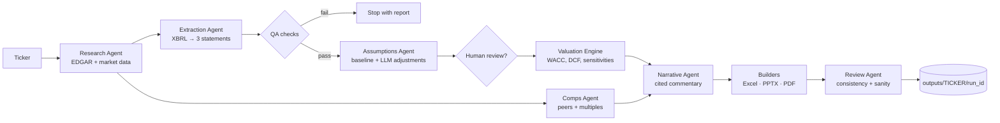

# Implementation Plan: Autonomous AI Investment Banking Analyst Agent

Give the agent a US public company ticker. It pulls the company's SEC filings and market data, pulls out and checks the three financial statements, builds a DCF model in Excel with live formulas, runs trading comps, writes cited commentary, and produces a pitch deck as PPTX and PDF. The deck gets the kind of review a VP would give before it goes to a client.

The project lives in `ib/` for now and will move to its own repository later. So `ib/` must be fully self-contained: its own `pyproject.toml`, Docker setup, tests, and docs. It must not import anything from the parent backtester project.

---

## 1. Goals and Non-Goals

### Goals

1. **Ticker in, deal-ready files out.** One command produces `model.xlsx`, `deck.pptx`, `deck.pdf`, and `run_manifest.json`.
2. **Numbers come from code, words come from the LLM.** Every financial figure comes from SEC XBRL data or market data through deterministic Python. The LLM writes narrative, suggests assumption adjustments with reasons, and proposes peers. It never makes up numbers.
3. **The Excel model is a real banker's model.** It uses live formulas (no pasted values), follows color conventions, and includes a checks sheet. A reviewer can change WACC and watch the whole model update.
4. **Auditable.** Every number traces back to an SEC accession number, an XBRL tag, and a period. Every narrative claim cites a filing section.
5. **Reproducible and portable.** Everything runs in Docker. No host Python or LibreOffice needed.
6. **Testable without the network or an LLM.** Tests use recorded fixtures and a fake LLM provider.

### Non-Goals (v1)

- Banks, insurers, and REITs. An unlevered-FCF DCF is the wrong tool for them. The agent detects them by SIC code and refuses with a clear message.
- Non-US issuers (IFRS / 20-F / 40-F filers).
- Consensus estimates or forward multiples from paid data (CapIQ, FactSet, Bloomberg).
- LBO, merger, and accretion/dilution models. Each is a separate project idea.
- Multi-user hosting, auth, or a production web deployment.

---

## 2. Guiding Principles

1. **Deterministic core, agentic edges.** Retrieval, extraction, and valuation are plain, testable Python. The LLM only handles judgment and language tasks, and its output goes through schema validation and guardrails.
2. **Filing text is untrusted input.** 10-K text goes into prompts as delimited data. It can never trigger tool calls, change file paths, or override instructions. This defends against prompt injection.
3. **One source of truth for valuation.** The Python DCF engine and the Excel formulas must agree to within $10^{-6}$ relative error. A parity test enforces this.
4. **Hand-checkable math.** Every formula (UFCF, WACC, terminal value, discounting, equity bridge) has a unit test on a small input whose answer is worked out by hand.
5. **A human reviews assumptions before the deck.** Assumptions are written to an editable YAML file. The `--review` flag pauses the run so the user can edit them.
6. **Fail loudly.** If the balance sheet doesn't balance, a required tag is missing, or $g \ge \text{WACC}$, the run stops with a clear error. It does not produce a plausible-looking wrong deck.
7. **Minimal dependencies.** Each dependency must earn its place (see §4).

---

## 3. System Architecture



### 3.1 Agents and Responsibilities

| Agent | Deterministic? | Inputs | Outputs |
|---|---|---|---|
| Research | Yes | Ticker | CIK, SIC, company facts JSON, latest 10-K / 10-Q documents, price history, shares, risk-free rate |
| Extraction | Yes | Company facts | Normalized `FinancialStatements` (IS, BS, CF) for up to 5 fiscal years plus LTM; source map per line item |
| QA | Yes | Statements | `QAReport` (pass / warn / fail per check) |
| Assumptions | Hybrid | Statements, MD&A text | `Assumptions` (baseline from history, LLM-suggested deltas with rationale and citations, clamped to bounds) |
| Valuation | Yes | Statements, assumptions, market data | `ValuationResult` (UFCF schedule, WACC build, EV, equity value, per-share value, sensitivity grids) |
| Comps | Hybrid | Target, candidate peers | Validated peer set, multiples table, summary statistics, implied valuation range |
| Narrative | LLM | Facts table, filing sections | Structured slide text (Pydantic), each claim cited |
| Review | Hybrid | All artifacts | `ReviewReport`: deterministic checks plus an LLM "VP review" of narrative/number consistency |

### 3.2 Orchestration

- A **plain Python orchestrator** with a typed `RunState` (Pydantic) and explicit steps. No agent framework in v1. Most steps are deterministic, and explicit control flow is easier to test, debug, and explain in interviews.
- Each step is a pure function `step(state) -> state` that records timing, inputs hash, and outputs in the manifest.
- Steps can be cached. Re-running with the same inputs skips completed steps (`--from-step`, `--force`).
- Possible later upgrade: move the graph to LangGraph if the agents need branching or retry loops. The step interface is designed so this is a drop-in change.

---

## 4. Technology Choices

| Concern | Choice | Reason |
|---|---|---|
| Language | Python 3.12 (in Docker) | Docker removes the host's Python 3.9 limit |
| Data models | `pydantic` v2 | Typed state, LLM output validation, JSON manifest |
| HTTP | `httpx` + `tenacity` | Timeouts, retries, backoff for SEC fair-access limits |
| HTTP cache | On-disk cache (`hishel` or a small SQLite cache) | Avoid repeat EDGAR calls, allow offline re-runs |
| Filing HTML parsing | `selectolax` or `beautifulsoup4` + `lxml` | Split the 10-K into Items 1, 1A, 7, 7A, 8 |
| Market data | `yfinance` | Free; unofficial, so wrapped behind an interface and cached |
| Risk-free rate | US Treasury daily par yield curve (CSV, no key); FRED optional | Free and authoritative |
| Numerics | `numpy`, `pandas` | Statement tables, sensitivities, beta regression |
| Excel | `openpyxl` | Writes formulas, styles, named ranges |
| Excel recalc / verification | LibreOffice headless (in Docker) | Recalculate formulas and compare with the Python engine |
| Deck | `python-pptx` with native (editable) charts | Bankers work in PowerPoint |
| PDF | LibreOffice headless `--convert-to pdf` | Same slides, no second rendering path |
| LLM | Provider interface: OpenAI, Anthropic, Ollama (local), Fake | Swappable; Ollama allows fully local runs |
| CLI | `typer` | Subcommands, typed options |
| API (later milestone) | `fastapi` + `uvicorn` | Trigger runs, download artifacts |
| Tests / lint | `pytest`, `ruff`, `mypy` (strict on `valuation/`) | |

Model names are never hard-coded. They come from `LLM_MODEL` in `.env`.

---

## 5. Repository Layout (target)

```
ib/
├── README.md
├── implementation.md
├── pyproject.toml
├── Dockerfile
├── docker-compose.yml
├── .dockerignore
├── .env.example
├── Makefile
├── config/
│   ├── defaults.yaml          # ERP, terminal growth bounds, tax fallback, forecast years
│   ├── xbrl_tag_map.yaml      # line item → ordered list of candidate US-GAAP tags
│   └── peers.yaml             # optional curated peer sets by ticker
├── src/ib_agent/
│   ├── __init__.py
│   ├── config.py              # settings from env + YAML (pydantic-settings)
│   ├── cli.py
│   ├── models/                # pydantic schemas
│   │   ├── company.py
│   │   ├── financials.py
│   │   ├── assumptions.py
│   │   ├── valuation.py
│   │   ├── comps.py
│   │   ├── narrative.py
│   │   └── run.py             # RunState, RunManifest
│   ├── data/
│   │   ├── edgar.py           # client: rate limit, User-Agent, cache
│   │   ├── tickers.py         # ticker → CIK via company_tickers.json
│   │   ├── filings.py         # 10-K/10-Q document fetch + section splitter
│   │   ├── market.py          # price, shares, market cap, price history
│   │   └── rates.py           # risk-free rate
│   ├── extraction/
│   │   ├── xbrl.py            # companyfacts → tidy facts frame
│   │   ├── statements.py      # tidy facts → IS / BS / CF, FY + LTM
│   │   └── checks.py          # QA checks
│   ├── valuation/
│   │   ├── beta.py
│   │   ├── wacc.py
│   │   ├── forecast.py
│   │   ├── dcf.py
│   │   ├── sensitivity.py
│   │   └── comps.py
│   ├── llm/
│   │   ├── base.py            # LLMProvider protocol, structured output helper
│   │   ├── openai_provider.py
│   │   ├── anthropic_provider.py
│   │   ├── ollama_provider.py
│   │   ├── fake_provider.py
│   │   ├── guardrails.py      # number verification, citation verification
│   │   └── prompts/           # versioned prompt templates (.md / .j2)
│   ├── agents/
│   │   ├── orchestrator.py
│   │   ├── research.py
│   │   ├── extraction.py
│   │   ├── assumptions.py
│   │   ├── valuation.py
│   │   ├── comps.py
│   │   ├── narrative.py
│   │   └── review.py
│   ├── outputs/
│   │   ├── excel/             # sheet builders, styles, named ranges
│   │   ├── deck/              # slide builders, chart helpers, template.pptx
│   │   ├── pdf.py             # LibreOffice conversion
│   │   └── recalc.py          # LibreOffice recalc + parity reader
│   └── api/                   # FastAPI app (later milestone)
├── tests/
│   ├── fixtures/
│   │   ├── edgar/             # recorded companyfacts / submissions JSON (trimmed)
│   │   ├── filings/           # trimmed 10-K HTML
│   │   ├── market/            # recorded price history CSV
│   │   └── llm/               # canned fake-provider responses
│   ├── unit/
│   ├── integration/
│   └── golden/                # end-to-end expected outputs for fixture company
└── outputs/                   # gitignored; mounted as a Docker volume
```

---

## 6. Docker Design

### 6.1 Images

**`Dockerfile`** (multi-stage):

1. `base`: `python:3.12-slim`. Sets `PYTHONDONTWRITEBYTECODE=1`, `PYTHONUNBUFFERED=1`.
2. `builder`: installs build tools and builds wheels for the project and its dependencies.
3. `runtime`:
   - Installs `libreoffice-calc`, `libreoffice-impress`, and `fonts-liberation` / `fonts-dejavu` with `--no-install-recommends`. The fonts keep PDF rendering consistent.
   - Copies wheels from `builder` and installs them.
   - Creates a non-root `analyst` user. Working directory `/app`. `outputs/` and cache directories are owned by `analyst`.
   - `ENTRYPOINT ["ib-agent"]`, `CMD ["--help"]`.
4. `dev` (target): `runtime` plus dev extras (`pytest`, `ruff`, `mypy`). Source is bind-mounted.

LibreOffice adds about 400–500 MB. That's an accepted cost: it's the only headless tool that both recalculates `.xlsx` formulas and converts `.pptx` to PDF faithfully.

### 6.2 Compose Services

| Service | Profile | Purpose |
|---|---|---|
| `analyst` | default | CLI runs: `docker compose run --rm analyst analyze MSFT` |
| `tests` | default | `docker compose run --rm tests` → `pytest` with network disabled |
| `api` | `api` | FastAPI on port 8000 (later milestone) |
| `ollama` | `local-llm` | Local LLM server; `analyst` connects via `OLLAMA_BASE_URL=http://ollama:11434` |

Volumes:

- `./outputs:/app/outputs`: artifacts visible on the host.
- `ib_cache:/app/.cache`: named volume for the HTTP cache and downloaded filings.
- `ollama_models`: named volume for local model weights.

### 6.3 Secrets and Configuration

- `.env` (gitignored) is loaded via `env_file`. `.env.example` is committed with placeholders only.
- Required: `SEC_USER_AGENT` (e.g. `"Your Name your@email.com"`, required by SEC fair-access policy).
- Optional: `LLM_PROVIDER` (`openai` | `anthropic` | `ollama` | `fake`), `LLM_MODEL`, `OPENAI_API_KEY`, `ANTHROPIC_API_KEY`, `OLLAMA_BASE_URL`, `FRED_API_KEY`.
- Secrets never go into image layers. `.dockerignore` excludes `.env`, `outputs/`, `.cache/`, `.git/`, and `tests/fixtures/**/raw/`.

### 6.4 Makefile Shortcuts

`make build`, `make test`, `make lint`, `make analyze T=MSFT`, `make shell`, `make local-llm`.

---

## 7. Data Layer

### 7.1 SEC EDGAR

Endpoints (all free, JSON unless noted):

- `https://www.sec.gov/files/company_tickers.json`: ticker → CIK.
- `https://data.sec.gov/submissions/CIK##########.json`: SIC code, fiscal year end, filing index (form, accession number, primary document).
- `https://data.sec.gov/api/xbrl/companyfacts/CIK##########.json`: all XBRL facts.
- Filing documents under `https://www.sec.gov/Archives/edgar/data/{cik}/{accession}/{primary_doc}` (HTML).

Client rules:

- Send the `User-Agent` header from `SEC_USER_AGENT`. Refuse to run without it.
- Token-bucket rate limiter, at most **10 requests/second** (SEC limit). Default 5 req/s.
- Retry on 429/5xx with exponential backoff and jitter (`tenacity`). Timeout 30 s.
- Cache responses on disk keyed by URL. TTL is 1 day for submissions and company facts, forever for archived filing documents (they don't change).
- Validate tickers with `^[A-Z][A-Z0-9.\-]{0,9}$` before any request or path use.

### 7.2 10-K Section Splitting

- Parse the primary HTML document into text. Remove inline XBRL tags but keep table text.
- Find the `Item 1.`, `Item 1A.`, `Item 7.`, `Item 7A.`, and `Item 8.` headings with tolerant regexes. Skip the table-of-contents matches by choosing the **last** heading occurrence that is followed by substantial text.
- Output `FilingSection(item, title, text, char_start, char_end, accession)`. Chunk into roughly 1,500-token passages with stable IDs (`{accession}:{item}:{chunk_no}`) for citations.
- Fallback: if splitting fails, the run continues with narrative limited to XBRL-derived facts, and the review report shows a warning.

### 7.3 Market Data

- `yfinance` behind a `MarketDataProvider` interface: last close, 52-week high/low, 5-year price history for the ticker and a benchmark (`^GSPC` or `SPY`).
- **Shares outstanding** come from XBRL `dei:EntityCommonStockSharesOutstanding` (cover page, most recent filing) first, with yfinance as fallback. The source goes in the manifest.
- **Diluted shares** use the treasury stock method when option/RSU data is available. Otherwise, use XBRL `WeightedAverageNumberOfDilutedSharesOutstanding` and flag it as an approximation.

### 7.4 Risk-Free Rate

- 10-year US Treasury par yield on the valuation date from the Treasury daily yield curve CSV. FRED `DGS10` is optional when `FRED_API_KEY` is set.
- Stored with its source URL and as-of date.

---

## 8. Financial Statement Extraction

### 8.1 Tag Mapping

`config/xbrl_tag_map.yaml` maps each canonical line item to an **ordered list** of candidate US-GAAP tags. The first tag with data for the period wins, and the tag used is recorded. Example:

```yaml
revenue:
  - RevenueFromContractWithCustomerExcludingAssessedTax
  - Revenues
  - SalesRevenueNet
  - RevenueFromContractWithCustomerIncludingAssessedTax
operating_income:
  - OperatingIncomeLoss
depreciation_amortization:
  - DepreciationDepletionAndAmortization
  - DepreciationAndAmortization
  - DepreciationAmortizationAndAccretionNet
capex:
  - PaymentsToAcquirePropertyPlantAndEquipment
  - PaymentsToAcquireProductiveAssets
```

Canonical line items (v1):

- **Income statement:** revenue, cost of revenue, gross profit, R&D, SG&A, operating income (EBIT), interest expense, pretax income, income tax expense, net income, diluted EPS, diluted weighted shares.
- **Balance sheet:** cash & equivalents, short-term investments, receivables, inventory, total current assets, PP&E net, goodwill, intangibles, total assets, accounts payable, total current liabilities, short-term debt / current portion of LTD, long-term debt, operating lease liabilities, total liabilities, noncontrolling interest, preferred stock, total equity.
- **Cash flow:** CFO, D&A, stock-based compensation, change in working capital components, capex, acquisitions, dividends, buybacks, CFI, CFF.

Derived items (computed, never tagged): EBITDA = EBIT + D&A, net debt, net working capital (excluding cash and debt), UFCF history.

### 8.2 Period Selection

- Keep facts where `form` is `10-K` / `10-K/A` and `fp == "FY"`. For LTM, also keep `10-Q` facts.
- Deduplicate by `(tag, end, duration)`. Take the **latest filed** value so restatements win.
- Duration facts (IS/CF): require a period length of about 365 days (±10) for FY and about 90 days for quarters. Instant facts (BS): match the period end date.
- **LTM** = latest FY + current YTD − prior-year YTD, computed per line item. BS uses the latest 10-Q instant.
- Normalize units to USD millions for display. Keep raw units internally.

### 8.3 QA Checks (`QAReport`)

| Check | Rule | Severity |
|---|---|---|
| Balance sheet balances | $\lvert A - (L + E_{total}) \rvert / A < 0.5\%$ | fail |
| Gross profit tie | revenue − COGS ≈ gross profit (if both tagged) | warn |
| EBITDA sanity | EBITDA ≥ EBIT | fail |
| Cash flow tie | CFO + CFI + CFF + FX ≈ Δcash | warn |
| Required items present | revenue, EBIT, D&A, capex, tax, cash, debt, shares | fail |
| History depth | ≥ 3 fiscal years | fail |
| Sign conventions | capex stored as positive outflow, consistent everywhere | fail |
| Sector eligibility | SIC not in 6000–6799 (financials / REITs) | fail |
| Stale data | latest 10-K is less than 15 months old | warn |

QA results appear in the Excel `Checks` sheet and the deck appendix.

---

## 9. Valuation Engine

All valuation code is pure functions over Pydantic models. No I/O, and mypy runs strict here.

### 9.1 Baseline Forecast (deterministic)

Five-year explicit forecast, driven as a percent of revenue:

- **Revenue growth:** starts at the 3-year historical CAGR and fades linearly to terminal growth $g$ by year 5.
- **EBIT margin:** 3-year average (option: linear convergence to a target margin).
- **Tax rate:** $\text{clip}(\text{tax expense} / \text{pretax income}, 0, 0.35)$ as the 3-year average. Fall back to 21% statutory if pretax income ≤ 0.
- **D&A, capex, ΔNWC:** 3-year average as a percent of revenue. ΔNWC is a percent of the *change* in revenue.
- **Stock-based compensation** is treated as a real expense by default (not added back). This is configurable, and the choice is stated in the deck.

### 9.2 Unlevered Free Cash Flow

$$
\text{UFCF}_t = \text{EBIT}_t (1 - \tau) + \text{D\&A}_t - \text{CapEx}_t - \Delta \text{NWC}_t
$$

### 9.3 WACC

$$
\text{WACC} = \frac{E}{D+E} r_e + \frac{D}{D+E} r_d (1 - \tau)
$$

- **Cost of equity (CAPM):** $r_e = r_f + \beta \cdot \text{ERP}$.
  - $\beta$: our own regression of 5-year monthly (or 2-year weekly) returns against the S&P 500, then Blume-adjusted: $\beta_{adj} = 0.67\,\beta_{raw} + 0.33$. The yfinance beta is shown only as a cross-check.
  - ERP: configurable default (e.g. 5.0%), with source noted.
  - Optional size premium: off by default.
- **Cost of debt:** interest expense / average total debt, clipped to $[r_f, r_f + 8\%]$. If debt ≈ 0, $r_d = r_f + 1.5\%$ and the weight is ~0.
- **Weights:** market value of equity (price × diluted shares) and book value of debt (including operating leases if configured).
- **Optional:** re-levered beta from the peer median unlevered beta (Hamada): $\beta_L = \beta_U [1 + (1-\tau) D/E]$.

### 9.4 Terminal Value and Discounting

- **Gordon growth:** $TV_N = \dfrac{\text{UFCF}_N (1+g)}{\text{WACC} - g}$. Requires $g < \text{WACC}$ and $g \le$ `max_terminal_growth` (default 4%).
- **Exit multiple:** $TV_N = \text{EBITDA}_N \times M$, where $M$ defaults to the peer median EV/EBITDA.
- **Mid-year convention** (default on): discount factor $(1 + \text{WACC})^{-(t - 0.5)}$ for cash flows. TV is discounted at $N$ under Gordon; the convention is configurable.
- Stub-period handling: if the valuation date is partway through the fiscal year, year 1 is prorated. (v1: no stub, just a documented assumption. Stub support is a stretch goal.)

### 9.5 Enterprise Value to Equity Value Bridge

$$
\text{Equity} = \text{EV} - \text{Debt} - \text{Preferred} - \text{NCI} + \text{Cash} + \text{ST investments}
$$

$$
\text{Implied share price} = \frac{\text{Equity}}{\text{Diluted shares}}
$$

Output both methods (Gordon and exit multiple), along with the **implied exit multiple** from Gordon and the **implied perpetual growth** from the exit multiple as cross-checks.

### 9.6 Sensitivities

- Implied share price over WACC (±200 bps, 50 bps steps) × terminal growth (±100 bps, 25 bps steps).
- Implied share price over WACC × exit multiple (±2.0x, 0.5x steps).
- Grid cells where $g \ge \text{WACC}$ are shown as "n.m." (not meaningful).

### 9.7 Sanity Flags (fed into the Review agent)

- Terminal value above 85% of EV.
- Negative UFCF in any year after year 2.
- Implied share price more than ±60% from the current price.
- Implied exit multiple outside the peer range by more than 50%.
- WACC outside [5%, 15%].

---

## 10. Trading Comparables

### 10.1 Peer Selection (in priority order)

1. User-provided: `--peers AAPL,MSFT,...`.
2. Curated `config/peers.yaml` entry for the ticker.
3. LLM-proposed candidates. The prompt includes the Item 1 business description and SIC. Each candidate is **validated**: the ticker exists in SEC `company_tickers.json`, the company has XBRL facts, and it is eligible (not financials). Candidates with a market cap outside 0.2x–5x of the target are dropped unless the user overrides. Keep 5–10 peers.

The final peer list and the reason each peer was included are recorded in the manifest and appear in the deck appendix.

### 10.2 Multiples

For the target and each peer, from the same extraction pipeline (LTM basis):

- EV / Revenue, EV / EBITDA, P / E, plus operating metrics (revenue growth, EBITDA margin).
- EV = market cap + debt + preferred + NCI − cash − ST investments.
- Negative or meaningless multiples (negative EBITDA/earnings, or above 100x) are marked "n.m." and excluded from the statistics.
- Summary rows: max, 75th percentile, **median**, mean, 25th percentile, min.
- Implied target valuation range from the 25th–75th percentile of each multiple, applied to the target's LTM metric.

---

## 11. LLM Layer

### 11.1 Provider Interface

```python
class LLMProvider(Protocol):
    def complete_structured(
        self, system: str, user: str, schema: type[BaseModel], *, temperature: float = 0.0
    ) -> BaseModel: ...
```

- Implementations: OpenAI, Anthropic, Ollama, and `FakeProvider`. The fake returns canned fixtures keyed by prompt ID and is used in all tests.
- Structured output uses the provider's native JSON/tool mode where available. Output is always validated with Pydantic, with one repair retry on validation failure.
- Temperature 0. Prompts are versioned files. The manifest records the prompt ID, a SHA-256 hash of the rendered prompt, the model name, and token usage.

### 11.2 LLM Tasks

| Task | Input | Output schema | Guardrails |
|---|---|---|---|
| Business overview | Item 1 chunks | `BusinessOverview(summary, segments[], citations[])` | citations must reference provided chunk IDs |
| Risk factors | Item 1A chunks | `RiskFactors(items[{title, summary, citation}])`, top 5 | same |
| MD&A highlights | Item 7 chunks + facts table | `MDAHighlights(points[], citations[])` | number verification |
| Assumption adjustments | Baseline assumptions + MD&A chunks | `AssumptionAdjustments(items[{field, delta, rationale, citation}])` | deltas clamped to configured bounds; each needs a citation |
| Peer suggestions | Item 1 + SIC | `PeerSuggestions(tickers[], rationale[])` | validated per §10.1 |
| Executive summary / slide text | Facts table + valuation summary | `DeckNarrative(...)` | number verification |
| VP review | Deck text + facts table | `ReviewFindings(issues[{severity, slide, issue}])` | advisory only; can't change numbers |

### 11.3 Guardrails

- **Number verification:** pull every numeric token (%, $, x, bn/mm) out of generated text. Each one must match a value in the provided facts table within rounding tolerance. Otherwise, regenerate once with the offending numbers listed, then fail the step.
- **Citation verification:** every citation ID must exist among the chunks sent in that prompt. Quoted snippets must appear verbatim in the chunk.
- **Prompt-injection hygiene:** filing text is wrapped in explicit delimiters and labelled as untrusted data. The system prompt tells the model to ignore instructions inside it. The LLM has no tools and no file or network access. Output is only ever parsed as a schema, never executed or used as a path.
- **Bounded budgets:** a per-run cap on total tokens and LLM calls (configurable). The run fails cleanly if the cap is exceeded.
- **No-LLM mode:** `LLM_PROVIDER=fake` or `--no-llm` produces the full model and a deck with deterministic templated text. The pipeline must never *need* an LLM to produce numbers.

---

## 12. Output Artifacts

### 12.1 Excel Model (`model.xlsx`)

Sheets:

1. **Cover:** company, ticker, valuation date, sources, and color legend.
2. **Inputs:** every assumption as a **blue** hard-coded input with a named range (`WACC`, `TGR`, `ExitMultiple`, `TaxRate`, ...).
3. **Historicals:** IS / BS / CF by fiscal year plus LTM. Hard-codes in blue, with a source-tag comment on each cell.
4. **Forecast:** revenue build and margin drivers. All **black formulas** referencing Inputs and Historicals.
5. **WACC:** CAPM build, cost of debt, weights, all formulas.
6. **DCF:** UFCF schedule, discount factors, TV (both methods), EV, equity bridge, per-share value.
7. **Sensitivity:** two grids. Each cell is a closed-form formula referencing the DCF rows, so no Excel Data Tables are needed and LibreOffice recalculates them reliably.
8. **Comps:** peer table, statistics, implied range. Cross-sheet links in **green**.
9. **Checks:** BS balance, CF tie, $g <$ WACC, TV % of EV, Python/Excel parity. Each shows TRUE/FALSE with conditional formatting, plus a master check cell.

Conventions: freeze panes, consistent number formats (`#,##0.0` for $mm, `0.0%`, `0.0x`), no merged cells in calculation areas, print areas set.

**Parity verification** (`outputs/recalc.py`): recalculate the workbook with LibreOffice headless, re-open with `openpyxl` (`data_only=True`), and compare EV, equity value, per-share value, and every sensitivity cell against `ValuationResult`. Relative tolerance $10^{-6}$. On mismatch the run fails.

### 12.2 Pitch Deck (`deck.pptx` → `deck.pdf`)

Built with `python-pptx` on a clean 16:9 template (`template.pptx`) using native, editable charts:

1. Cover: company, "Preliminary Valuation Discussion Materials", date, "Strictly Confidential / For discussion purposes only".
2. Executive summary: valuation range, current price, key takeaways.
3. Company overview: business description and segments (cited).
4. Historical financial performance: revenue and EBITDA bar/line chart, margin table.
5. Key risk factors (cited from Item 1A).
6. MD&A highlights (cited).
7. DCF key assumptions.
8. DCF output: UFCF schedule, EV-to-equity bridge (waterfall-style chart).
9. Sensitivity tables.
10. Trading comparables table.
11. **Football field:** DCF (Gordon), DCF (exit), comps EV/EBITDA, comps EV/Revenue, comps P/E, and 52-week range, with the current price line.
12. Appendix: methodology, sources (accession numbers, retrieval dates), QA summary, disclaimer.

PDF: `soffice --headless --convert-to pdf`. A snapshot test checks page count and that key text strings are present.

### 12.3 Run Manifest (`run_manifest.json`)

Run ID, timestamps, git SHA / package version, CLI args, all source URLs with retrieval timestamps and accession numbers, the tag used for each line item, the assumptions (baseline, LLM deltas, final), LLM calls (prompt ID, hash, model, tokens), QA and review reports, and artifact paths with SHA-256 hashes.

Output location: `outputs/{TICKER}/{YYYYMMDD-HHMMSS}/`. Paths are built only from the validated ticker and a generated timestamp.

---

## 13. CLI (target)

```
ib-agent analyze TICKER [--peers A,B,C] [--review] [--no-llm]
                        [--valuation-date YYYY-MM-DD] [--from-step STEP] [--force]
ib-agent fetch TICKER                 # data only, populate cache
ib-agent extract TICKER               # statements + QA report to console / CSV
ib-agent value TICKER --assumptions path.yaml
ib-agent build RUN_DIR                # rebuild Excel/PPTX/PDF from saved state
ib-agent verify RUN_DIR               # re-run parity + review checks
```

With `--review`, the run writes `assumptions.yaml`, prints a summary table, and waits. The user edits the file and confirms, then the run continues. For non-interactive use, run `value --assumptions` later.

---

## 14. Testing Strategy

| Layer | What | How |
|---|---|---|
| Unit: math | UFCF, WACC, Gordon TV, exit TV, mid-year discounting, equity bridge, Blume beta, LTM roll-forward, sensitivity grid | Hand-computed examples, exact or `pytest.approx` |
| Unit: extraction | Tag fallback, dedup/restatement, FY duration filter, unit scaling | Small synthetic companyfacts JSON |
| Unit: QA | Each check passes and fails | Synthetic statements |
| Unit: guardrails | Number extraction/matching, citation validation, injection text passed through as data | Crafted strings |
| Unit: filings | Section splitter picks body not TOC | Trimmed real 10-K HTML fixture |
| Integration | Full pipeline on one fixture company with `FakeProvider` and recorded HTTP | `respx` / cached fixtures; no network |
| Parity | Excel formulas vs Python engine | LibreOffice recalc (runs in the Docker `tests` service) |
| Golden | Fixture company's EV, per-share value, and deck text | Stored expected values; diff on change |
| Live (opt-in) | Real EDGAR + market data for 3 tickers | `pytest -m live`; excluded by default |

The `tests` compose service runs with `network_mode: none` to prove tests don't touch the network.

Suggested fixture company: a stable non-financial large-cap with clean XBRL, e.g. a consumer or industrial name. Choose it in M1 and trim its companyfacts to the tags in use to keep the fixture small.

---

## 15. Milestones

Each milestone ends with passing tests in Docker (`make test`) and a short demo command.

### M0 — Scaffolding and Docker
- `pyproject.toml` (package `ib_agent`, console script `ib-agent`), `src/` layout, `ruff` / `mypy` / `pytest` configuration.
- `Dockerfile` (multi-stage, non-root, LibreOffice), `docker-compose.yml` (`analyst`, `tests`), `.dockerignore`, `.env.example`, `Makefile`.
- `config.py` loads env + `config/defaults.yaml`. `ib-agent --help` works in the container.
- **Done when:** `make build && make test` passes with a smoke test; `docker compose run --rm analyst --help` prints usage.

### M1 — EDGAR Client and Research Agent
- Rate-limited, cached, retrying client. Ticker → CIK. Submissions (SIC, FYE, filing index). Company facts. Latest 10-K / 10-Q document download.
- Record fixtures for the chosen fixture company.
- **Done when:** `ib-agent fetch TICKER` populates the cache; a second call makes no HTTP requests; the SIC exclusion works.

### M2 — Statement Extraction and QA
- Tag map, tidy facts, FY and LTM statements, derived items, QA report. CSV export for inspection.
- **Done when:** `ib-agent extract TICKER` prints 3–5 years of IS/BS/CF matching the 10-K for the fixture company (spot-check 10 line items by hand); all QA checks unit-tested.

### M3 — Market Data, Rates, Beta, WACC
- Price, 52-week range, shares (XBRL-first), Treasury 10Y, beta regression + Blume, cost of debt, WACC.
- **Done when:** the WACC build is unit-tested by hand and shows up in `extract` output.

### M4 — DCF Engine and Sensitivities
- Baseline forecast, UFCF, both TV methods, mid-year convention, equity bridge, cross-check implied metrics, sensitivity grids, sanity flags.
- `assumptions.yaml` round-trip (dump / load / validate with bounds).
- **Done when:** hand-checked DCF tests pass; `ib-agent value TICKER` prints the valuation summary.

### M5 — Excel Model Builder and Parity
- All sheets from §12.1 with named ranges, styles, and formulas. LibreOffice recalc and parity check.
- **Done when:** the parity test passes inside Docker; changing `WACC` in Excel updates the per-share value and sensitivities; the Checks sheet master cell is TRUE for the fixture company.

### M6 — Trading Comps
- Peer resolution (user / curated), multiples, statistics, implied range. Comps sheet in Excel. Exit multiple default from the peer median.
- **Done when:** the comps table matches hand calculations for fixtures; "n.m." handling tested.

### M7 — LLM Layer and Filing Sections
- Provider interface + OpenAI / Anthropic / Ollama / Fake. 10-K section splitter and chunking. Prompts for overview, risks, MD&A, assumption adjustments, peer suggestions. Guardrails (numbers, citations, budget).
- `ollama` compose profile.
- **Done when:** all LLM tasks run with `FakeProvider` in tests; one live run per real provider done manually; guardrail tests cover injection text and made-up numbers.

### M8 — Orchestrator, Manifest, Human Review
- `RunState`, step registry, caching / `--from-step`, run manifest, `--review` flow, `--no-llm` mode.
- **Done when:** `ib-agent analyze TICKER --no-llm` produces `model.xlsx` + `run_manifest.json` end to end from fixtures; the integration test passes offline.

### M9 — Pitch Deck and PDF
- Template, slide builders, native charts (financials, bridge, football field), tables, citations in footnotes. LibreOffice PDF conversion.
- **Done when:** `analyze` produces `deck.pptx` and `deck.pdf`; the snapshot test checks slide count and key strings; the deck is reviewed visually for 3 tickers.

### M10 — Review Agent
- Deterministic review (sanity flags, QA, parity, deck-number vs model-number consistency) + LLM VP review. `review_report.md` in the run folder, summarized in the appendix.
- **Done when:** seeded inconsistencies (e.g. a wrong number in slide text) are caught in tests.

### M11 — API and Polish (optional)
- FastAPI: `POST /runs {ticker, peers, options}` → run ID; `GET /runs/{id}` status; `GET /runs/{id}/artifacts/{name}` download with an allow-list of artifact names. `api` compose profile.
- Demo runs on 3 diverse tickers (e.g. software, consumer, industrial) stored as sample outputs. Final README with screenshots.
- **Done when:** the API works in Docker; README quickstart verified from a clean clone.

### Stretch
- Stub-period / partial-year discounting; quarterly LTM for all line items.
- Segment-level revenue builds from XBRL dimensional data.
- Precedent transactions from 8-K / DEFM14A filings.
- Streamlit UI to tweak assumptions and regenerate.
- Scenario cases (base / upside / downside) as an Excel scenario switch.

---

## 16. Risks and Mitigations

| Risk | Mitigation |
|---|---|
| XBRL tag inconsistency across companies | Ordered tag fallbacks, fail-loud required items, per-item source recording, curated overrides per ticker in YAML |
| yfinance breakage / throttling | Interface + cache; XBRL-first for shares; clear error with manual override flags (`--price`, `--beta`) |
| 10-K HTML layout variance breaks section split | Tolerant regexes, TOC skip heuristic, graceful degradation to facts-only narrative |
| LLM hallucinated numbers or citations | Number and citation verification, facts-only prompts, deterministic fallback text |
| Prompt injection via filing text | Delimited untrusted data, no tools, schema-only parsing, no dynamic paths |
| Excel / Python divergence | Automated LibreOffice parity test on every run and in CI |
| Large Docker image | Multi-stage build, `--no-install-recommends`, only calc + impress components |
| SEC fair-access violations | Mandatory User-Agent, rate limiter below the 10 req/s limit, aggressive caching |
| Output looks authoritative but is wrong | Checks sheet, review report, "preliminary / not investment advice" disclaimers on every artifact |

---

## 17. Separation into Its Own Repository Later

To make the future move trivial:

- No imports from `quant_backtester` or any path outside `ib/`.
- All paths relative to `ib/`. Docker build context is `ib/`.
- Own `pyproject.toml`, `README.md`, `.gitignore`, and `.dockerignore` inside `ib/`.
- Moving later: `git subtree split --prefix=ib -b ib-agent` keeps history, then push the branch to a new repository.
