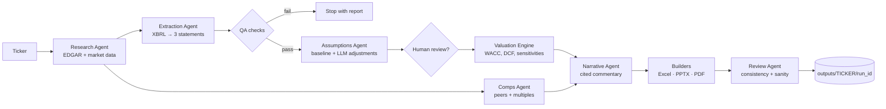
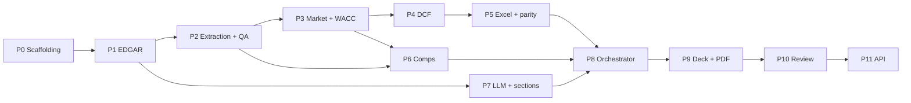

# Implementation Plan: Autonomous AI Investment Banking Analyst Agent

Give the agent a US public company ticker. It pulls the company's SEC filings and market data, pulls out and checks the three financial statements, builds a DCF model in Excel with live formulas, runs trading comps, writes cited commentary, and produces a pitch deck as PPTX and PDF. The deck gets the kind of review a VP would give before it goes to a client.

The project lives in its own repository (`ValuationAgent/`) and is fully self-contained: its own `pyproject.toml`, Docker setup, tests, and docs. Older notes that refer to an `ib/` folder mean the repository root.

---

## 0. Current Status (as of 2026-09-30)

**Summary:** Phases 0–2 are complete, and Phase 3 is in progress. Phase 3 now has a shared cached HTTP transport plus unit-tested beta and WACC calculations; market/rate providers, share sourcing, and CLI integration remain outstanding. Phases 1 and 2 are verified against a synthetic fixture company; a recorded real-company fixture is still outstanding. The CLI has three commands: `version`, `fetch`, and `extract`. The detailed phase plan is in [§15](#15-phased-implementation-plan). Run instructions are in [HOW_TO_RUN.md](HOW_TO_RUN.md).

### 0.1 What Exists

| Area | Status | Location | Notes |
|---|---|---|---|
| Packaging and tooling | Done | `pyproject.toml` | Python ≥3.12; deps: `httpx`, `pydantic` v2, `pydantic-settings`, `pyyaml`, `tenacity`, `typer`. `ruff`, `mypy` (pydantic plugin), `pytest` with a `live` marker excluded by default |
| Docker | Done for current phases | `Dockerfile`, `docker-compose.yml` | Multi-stage (`base` → `builder` → `runtime` → `dev`), non-root `analyst`, LibreOffice Calc + Impress, Liberation/DejaVu fonts. Services: `analyst`, `tests` (`network_mode: none`), `ollama` (`local-llm` profile). API service is deferred to Phase 11 |
| Makefile | Partial | `Makefile` | `build`, `test`, `lint`, `fmt`, `fetch`, `extract`, `local-llm`, `shell`. `analyze` calls a CLI command not implemented until Phase 8 |
| Settings and defaults | Done | `src/ib_agent/config.py`, `config/defaults.yaml` | Env settings (`SEC_USER_AGENT`, LLM vars, dirs). `edgar` and `valuation` YAML sections with field and cross-field bounds; unknown keys rejected |
| Errors | Done | `src/ib_agent/errors.py` | `IBAgentError` hierarchy: config, ticker, HTTP, EDGAR, unsupported company, filing not found |
| HTTP cache | Done | `src/ib_agent/data/cache.py` | SHA-256-keyed file cache, TTL per call, atomic writes |
| Rate limiter | Done | `src/ib_agent/data/rate_limit.py` | Minimum-interval limiter (default 5 req/s). Not a token bucket; acceptable at SEC volumes |
| HTTP transport and EDGAR client | Done for transport extraction | `src/ib_agent/data/http.py`, `src/ib_agent/data/edgar.py` | Configurable HTTPS host allow-list, retries, cache, rate limiter, and source records; EDGAR wrapper retains mandatory User-Agent and SEC-only policy |
| Ticker resolution | Done | `src/ib_agent/data/tickers.py` | Regex validation, `BRK.B` → `BRK-B` handling |
| Company models | Done | `src/ib_agent/models/company.py`, `models/sources.py` | `CompanyRef`, `FilingRef`, `CompanyProfile` (SIC 6000–6799 detection), `parse_submissions` |
| Research agent | Done | `src/ib_agent/agents/research.py` | Ticker → CIK → submissions → refuse financials → latest 10-K (10-K/A excluded) + newer 10-Q → company facts → download filing HTML (downloaded, not parsed) |
| Extraction + QA | Done | `config/xbrl_tag_map.yaml`, `src/ib_agent/extraction/`, `models/financials.py`, `models/qa.py`, `agents/extraction.py` | Ordered tag fallback with `sum_of` fallbacks, restatement dedup (latest `filed` wins), periods labelled by `end` date, FY + LTM roll-forward, outflow sign normalization, derived EBITDA / debt / NWC / tax rate / historical UFCF, 9 QA checks from §8.3 |
| CLI | Partial | `src/ib_agent/cli.py` | `version`, `fetch TICKER [--refresh]`, `extract TICKER [--csv DIR] [--refresh]` (exit code 2 on QA failure) |
| Beta and WACC calculations | Phase 3 groundwork | `src/ib_agent/valuation/beta.py`, `valuation/wacc.py` | OLS beta, Blume adjustment, unlever/relever, cost of debt, capital weights, WACC; not yet connected to market data or CLI |
| Tests | Done for current scope | `tests/` | 14 unit files + 2 integration files (114 tests). `FakeSEC` over `httpx.MockTransport`; socket connections blocked unless marked `live` |
| Market/rate providers, shares, valuation engine, comps, LLM, orchestrator, Excel, deck, PDF, review, API | Not started | — | No market/rates providers or end-to-end valuation pipeline yet |
| `config/peers.yaml` | Not started | — | |
| CI | Removed | — | The workflow was removed in commit `b832411`; re-add `.github/workflows/ci.yml` (Ruff, mypy, pytest on Python 3.12) |

### 0.2 Known Gaps and Debt to Carry Forward

1. **Fixture company is synthetic.** `companyfacts_CIK0000000001.json` (ACME) now has 4 fiscal years, a restatement, a tag switch, and Q1 YTD periods with a balance sheet that ties, which is enough to exercise Phase 2. The 10-K/10-Q HTML fixtures are still placeholders, and real-world XBRL quirks remain untested until a real company is recorded. (Phase 1.)
2. **External data providers are not implemented.** The reusable transport now takes a configurable host allow-list, but Treasury / FRED and market-data integrations remain Phase 3 work.
3. **Research output isn't persisted.** `ResearchResult` lives in memory; there is no run directory yet. (Phase 8.)
4. **Host Python is 3.9.** Use Docker or install Python 3.12 for the documented local setup.

---

## 1. Goals and Non-Goals

### Goals

1. **Ticker in, deal-ready files out.** One command produces `model.xlsx`, `deck.pptx`, `deck.pdf`, and `run_manifest.json`.
2. **Numbers come from code, words come from the LLM.** Every financial figure comes from SEC XBRL data or market data through deterministic Python. The LLM writes narrative, suggests assumption adjustments with reasons, and proposes peers. It never makes up numbers.
3. **The Excel model is a real banker's model.** It uses live formulas (no pasted values), follows color conventions, and includes a checks sheet. A reviewer can change WACC and watch the whole model update.
4. **Auditable.** Every number traces back to an SEC accession number, an XBRL tag, and a period. Every narrative claim cites a filing section.
5. **Reproducible and portable.** Everything runs in Docker. No host Python or LibreOffice needed.
6. **Testable without the network or an LLM.** Tests use recorded fixtures and a fake LLM provider.

### Non-Goals (v1)

- Banks, insurers, and REITs. An unlevered-FCF DCF is the wrong tool for them. The agent detects them by SIC code and refuses with a clear message.
- Non-US issuers (IFRS / 20-F / 40-F filers).
- Consensus estimates or forward multiples from paid data (CapIQ, FactSet, Bloomberg).
- LBO, merger, and accretion/dilution models. Each is a separate project idea.
- Multi-user hosting, auth, or a production web deployment.

---

## 2. Guiding Principles

1. **Deterministic core, agentic edges.** Retrieval, extraction, and valuation are plain, testable Python. The LLM only handles judgment and language tasks, and its output goes through schema validation and guardrails.
2. **Filing text is untrusted input.** 10-K text goes into prompts as delimited data. It can never trigger tool calls, change file paths, or override instructions. This defends against prompt injection.
3. **One source of truth for valuation.** The Python DCF engine and the Excel formulas must agree to within $10^{-6}$ relative error. A parity test enforces this.
4. **Hand-checkable math.** Every formula (UFCF, WACC, terminal value, discounting, equity bridge) has a unit test on a small input whose answer is worked out by hand.
5. **A human reviews assumptions before the deck.** Assumptions are written to an editable YAML file. The `--review` flag pauses the run so the user can edit them.
6. **Fail loudly.** If the balance sheet doesn't balance, a required tag is missing, or $g \ge \text{WACC}$, the run stops with a clear error. It does not produce a plausible-looking wrong deck.
7. **Minimal dependencies.** Each dependency must earn its place (see §4).

---

## 3. System Architecture



### 3.1 Agents and Responsibilities

| Agent | Deterministic? | Inputs | Outputs |
|---|---|---|---|
| Research | Yes | Ticker | CIK, SIC, company facts JSON, latest 10-K / 10-Q documents, price history, shares, risk-free rate |
| Extraction | Yes | Company facts | Normalized `FinancialStatements` (IS, BS, CF) for up to 5 fiscal years plus LTM; source map per line item |
| QA | Yes | Statements | `QAReport` (pass / warn / fail per check) |
| Assumptions | Hybrid | Statements, MD&A text | `Assumptions` (baseline from history, LLM-suggested deltas with rationale and citations, clamped to bounds) |
| Valuation | Yes | Statements, assumptions, market data | `ValuationResult` (UFCF schedule, WACC build, EV, equity value, per-share value, sensitivity grids) |
| Comps | Hybrid | Target, candidate peers | Validated peer set, multiples table, summary statistics, implied valuation range |
| Narrative | LLM | Facts table, filing sections | Structured slide text (Pydantic), each claim cited |
| Review | Hybrid | All artifacts | `ReviewReport`: deterministic checks plus an LLM "VP review" of narrative/number consistency |

### 3.2 Orchestration

- A **plain Python orchestrator** with a typed `RunState` (Pydantic) and explicit steps. No agent framework in v1. Most steps are deterministic, and explicit control flow is easier to test, debug, and explain in interviews.
- Each step is a pure function `step(state) -> state` that records timing, inputs hash, and outputs in the manifest.
- Steps can be cached. Re-running with the same inputs skips completed steps (`--from-step`, `--force`).
- Possible later upgrade: move the graph to LangGraph if the agents need branching or retry loops. The step interface is designed so this is a drop-in change.

---

## 4. Technology Choices

| Concern | Choice | Reason |
|---|---|---|
| Language | Python 3.12 (in Docker) | Docker removes the host's Python 3.9 limit |
| Data models | `pydantic` v2 | Typed state, LLM output validation, JSON manifest |
| HTTP | `httpx` + `tenacity` | Timeouts, retries, backoff for SEC fair-access limits |
| HTTP cache | On-disk cache (`hishel` or a small SQLite cache) | Avoid repeat EDGAR calls, allow offline re-runs |
| Filing HTML parsing | `selectolax` or `beautifulsoup4` + `lxml` | Split the 10-K into Items 1, 1A, 7, 7A, 8 |
| Market data | `yfinance` | Free; unofficial, so wrapped behind an interface and cached |
| Risk-free rate | US Treasury daily par yield curve (CSV, no key); FRED optional | Free and authoritative |
| Numerics | `numpy`, `pandas` | Statement tables, sensitivities, beta regression |
| Excel | `openpyxl` | Writes formulas, styles, named ranges |
| Excel recalc / verification | LibreOffice headless (in Docker) | Recalculate formulas and compare with the Python engine |
| Deck | `python-pptx` with native (editable) charts | Bankers work in PowerPoint |
| PDF | LibreOffice headless `--convert-to pdf` | Same slides, no second rendering path |
| LLM | Provider interface: OpenAI, Anthropic, Ollama (local), Fake | Swappable; Ollama allows fully local runs |
| CLI | `typer` | Subcommands, typed options |
| API (later milestone) | `fastapi` + `uvicorn` | Trigger runs, download artifacts |
| Tests / lint | `pytest`, `ruff`, `mypy` (strict on `valuation/`) | |

Model names are never hard-coded. They come from `LLM_MODEL` in `.env`.

---

## 5. Repository Layout (target)

```
ValuationAgent/
├── README.md
├── implementation.md
├── pyproject.toml
├── Dockerfile
├── docker-compose.yml
├── .dockerignore
├── .env.example
├── Makefile
├── config/
│   ├── defaults.yaml          # ERP, terminal growth bounds, tax fallback, forecast years
│   ├── xbrl_tag_map.yaml      # line item → ordered list of candidate US-GAAP tags
│   └── peers.yaml             # optional curated peer sets by ticker
├── src/ib_agent/
│   ├── __init__.py
│   ├── config.py              # settings from env + YAML (pydantic-settings)
│   ├── cli.py
│   ├── models/                # pydantic schemas
│   │   ├── company.py
│   │   ├── financials.py
│   │   ├── assumptions.py
│   │   ├── valuation.py
│   │   ├── comps.py
│   │   ├── narrative.py
│   │   └── run.py             # RunState, RunManifest
│   ├── data/
│   │   ├── edgar.py           # client: rate limit, User-Agent, cache
│   │   ├── tickers.py         # ticker → CIK via company_tickers.json
│   │   ├── filings.py         # 10-K/10-Q document fetch + section splitter
│   │   ├── market.py          # price, shares, market cap, price history
│   │   └── rates.py           # risk-free rate
│   ├── extraction/
│   │   ├── xbrl.py            # companyfacts → tidy facts frame
│   │   ├── statements.py      # tidy facts → IS / BS / CF, FY + LTM
│   │   └── checks.py          # QA checks
│   ├── valuation/
│   │   ├── beta.py
│   │   ├── wacc.py
│   │   ├── forecast.py
│   │   ├── dcf.py
│   │   ├── sensitivity.py
│   │   └── comps.py
│   ├── llm/
│   │   ├── base.py            # LLMProvider protocol, structured output helper
│   │   ├── openai_provider.py
│   │   ├── anthropic_provider.py
│   │   ├── ollama_provider.py
│   │   ├── fake_provider.py
│   │   ├── guardrails.py      # number verification, citation verification
│   │   └── prompts/           # versioned prompt templates (.md / .j2)
│   ├── agents/
│   │   ├── orchestrator.py
│   │   ├── research.py
│   │   ├── extraction.py
│   │   ├── assumptions.py
│   │   ├── valuation.py
│   │   ├── comps.py
│   │   ├── narrative.py
│   │   └── review.py
│   ├── outputs/
│   │   ├── excel/             # sheet builders, styles, named ranges
│   │   ├── deck/              # slide builders, chart helpers, template.pptx
│   │   ├── pdf.py             # LibreOffice conversion
│   │   └── recalc.py          # LibreOffice recalc + parity reader
│   └── api/                   # FastAPI app (later milestone)
├── tests/
│   ├── fixtures/
│   │   ├── edgar/             # recorded companyfacts / submissions JSON (trimmed)
│   │   ├── filings/           # trimmed 10-K HTML
│   │   ├── market/            # recorded price history CSV
│   │   └── llm/               # canned fake-provider responses
│   ├── unit/
│   ├── integration/
│   └── golden/                # end-to-end expected outputs for fixture company
└── outputs/                   # gitignored; mounted as a Docker volume
```

---

## 6. Docker Design

### 6.1 Images

**`Dockerfile`** (multi-stage):

1. `base`: `python:3.12-slim`. Sets `PYTHONDONTWRITEBYTECODE=1`, `PYTHONUNBUFFERED=1`.
2. `builder`: installs build tools and builds wheels for the project and its dependencies.
3. `runtime`:
   - Installs `libreoffice-calc`, `libreoffice-impress`, and `fonts-liberation` / `fonts-dejavu` with `--no-install-recommends`. The fonts keep PDF rendering consistent.
   - Copies wheels from `builder` and installs them.
   - Creates a non-root `analyst` user. Working directory `/app`. `outputs/` and cache directories are owned by `analyst`.
   - `ENTRYPOINT ["ib-agent"]`, `CMD ["--help"]`.
4. `dev` (target): `runtime` plus dev extras (`pytest`, `ruff`, `mypy`). Source is bind-mounted.

LibreOffice adds about 400–500 MB. That's an accepted cost: it's the only headless tool that both recalculates `.xlsx` formulas and converts `.pptx` to PDF faithfully.

### 6.2 Compose Services

| Service | Profile | Purpose |
|---|---|---|
| `analyst` | default | CLI runs: `docker compose run --rm analyst analyze MSFT` |
| `tests` | default | `docker compose run --rm tests` → `pytest` with network disabled |
| `api` | `api` | FastAPI on port 8000 (later milestone) |
| `ollama` | `local-llm` | Local LLM server; `analyst` connects via `OLLAMA_BASE_URL=http://ollama:11434` |

Volumes:

- `./outputs:/app/outputs`: artifacts visible on the host.
- `ib_cache:/app/.cache`: named volume for the HTTP cache and downloaded filings.
- `ollama_models`: named volume for local model weights.

### 6.3 Secrets and Configuration

- `.env` (gitignored) is loaded via `env_file`. `.env.example` is committed with placeholders only.
- Required: `SEC_USER_AGENT` (e.g. `"Your Name your@email.com"`, required by SEC fair-access policy).
- Optional: `LLM_PROVIDER` (`openai` | `anthropic` | `ollama` | `fake`), `LLM_MODEL`, `OPENAI_API_KEY`, `ANTHROPIC_API_KEY`, `OLLAMA_BASE_URL`, `FRED_API_KEY`.
- Secrets never go into image layers. `.dockerignore` excludes `.env`, `outputs/`, `.cache/`, `.git/`, and `tests/fixtures/**/raw/`.

### 6.4 Makefile Shortcuts

`make build`, `make test`, `make lint`, `make analyze T=MSFT`, `make shell`, `make local-llm`.

---

## 7. Data Layer

### 7.1 SEC EDGAR

Endpoints (all free, JSON unless noted):

- `https://www.sec.gov/files/company_tickers.json`: ticker → CIK.
- `https://data.sec.gov/submissions/CIK##########.json`: SIC code, fiscal year end, filing index (form, accession number, primary document).
- `https://data.sec.gov/api/xbrl/companyfacts/CIK##########.json`: all XBRL facts.
- Filing documents under `https://www.sec.gov/Archives/edgar/data/{cik}/{accession}/{primary_doc}` (HTML).

Client rules:

- Send the `User-Agent` header from `SEC_USER_AGENT`. Refuse to run without it.
- Rate limiter (minimum interval between requests), at most **10 requests/second** (SEC limit). Default 5 req/s.
- Retry on 429/5xx with exponential backoff and jitter (`tenacity`). Timeout 30 s.
- Cache responses on disk keyed by URL. TTL is 1 day for submissions and company facts, forever for archived filing documents (they don't change).
- Validate tickers with `^[A-Z][A-Z0-9.\-]{0,9}$` before any request or path use.

### 7.2 10-K Section Splitting

- Parse the primary HTML document into text. Remove inline XBRL tags but keep table text.
- Find the `Item 1.`, `Item 1A.`, `Item 7.`, `Item 7A.`, and `Item 8.` headings with tolerant regexes. Skip the table-of-contents matches by choosing the **last** heading occurrence that is followed by substantial text.
- Output `FilingSection(item, title, text, char_start, char_end, accession)`. Chunk into roughly 1,500-token passages with stable IDs (`{accession}:{item}:{chunk_no}`) for citations.
- Fallback: if splitting fails, the run continues with narrative limited to XBRL-derived facts, and the review report shows a warning.

### 7.3 Market Data

- `yfinance` behind a `MarketDataProvider` interface: last close, 52-week high/low, 5-year price history for the ticker and a benchmark (`^GSPC` or `SPY`).
- **Shares outstanding** come from XBRL `dei:EntityCommonStockSharesOutstanding` (cover page, most recent filing) first, with yfinance as fallback. The source goes in the manifest.
- **Diluted shares** use the treasury stock method when option/RSU data is available. Otherwise, use XBRL `WeightedAverageNumberOfDilutedSharesOutstanding` and flag it as an approximation.

### 7.4 Risk-Free Rate

- 10-year US Treasury par yield on the valuation date from the Treasury daily yield curve CSV. FRED `DGS10` is optional when `FRED_API_KEY` is set.
- Stored with its source URL and as-of date.

---

## 8. Financial Statement Extraction

### 8.1 Tag Mapping

`config/xbrl_tag_map.yaml` maps each canonical line item to an **ordered list** of candidate US-GAAP tags. The first tag with data for the period wins, and the tag used is recorded. Example:

```yaml
revenue:
  - RevenueFromContractWithCustomerExcludingAssessedTax
  - Revenues
  - SalesRevenueNet
  - RevenueFromContractWithCustomerIncludingAssessedTax
operating_income:
  - OperatingIncomeLoss
depreciation_amortization:
  - DepreciationDepletionAndAmortization
  - DepreciationAndAmortization
  - DepreciationAmortizationAndAccretionNet
capex:
  - PaymentsToAcquirePropertyPlantAndEquipment
  - PaymentsToAcquireProductiveAssets
```

Canonical line items (v1):

- **Income statement:** revenue, cost of revenue, gross profit, R&D, SG&A, operating income (EBIT), interest expense, pretax income, income tax expense, net income, diluted EPS, diluted weighted shares.
- **Balance sheet:** cash & equivalents, short-term investments, receivables, inventory, total current assets, PP&E net, goodwill, intangibles, total assets, accounts payable, total current liabilities, short-term debt / current portion of LTD, long-term debt, operating lease liabilities, total liabilities, noncontrolling interest, preferred stock, total equity.
- **Cash flow:** CFO, D&A, stock-based compensation, change in working capital components, capex, acquisitions, dividends, buybacks, CFI, CFF.

Derived items (computed, never tagged): EBITDA = EBIT + D&A, net debt, net working capital (excluding cash and debt), UFCF history.

### 8.2 Period Selection

- Keep facts where `form` is `10-K` / `10-K/A` and `fp == "FY"`. For LTM, also keep `10-Q` facts.
- Deduplicate by `(tag, end, duration)`. Take the **latest filed** value so restatements win.
- Duration facts (IS/CF): require a period length of about 365 days (±10) for FY and about 90 days for quarters. Instant facts (BS): match the period end date.
- **LTM** = latest FY + current YTD − prior-year YTD, computed per line item. BS uses the latest 10-Q instant.
- Normalize units to USD millions for display. Keep raw units internally.

### 8.3 QA Checks (`QAReport`)

| Check | Rule | Severity |
|---|---|---|
| Balance sheet balances | $\lvert A - (L + E_{total}) \rvert / A < 0.5\%$ | fail |
| Gross profit tie | revenue − COGS ≈ gross profit (if both tagged) | warn |
| EBITDA sanity | EBITDA ≥ EBIT | fail |
| Cash flow tie | CFO + CFI + CFF + FX ≈ Δcash | warn |
| Required items present | revenue, EBIT, D&A, capex, tax, cash, debt, shares | fail |
| History depth | ≥ 3 fiscal years | fail |
| Sign conventions | capex stored as positive outflow, consistent everywhere | fail |
| Sector eligibility | SIC not in 6000–6799 (financials / REITs) | fail |
| Stale data | latest 10-K is less than 15 months old | warn |

QA results appear in the Excel `Checks` sheet and the deck appendix.

---

## 9. Valuation Engine

All valuation code is pure functions over Pydantic models. No I/O, and mypy runs strict here.

### 9.1 Baseline Forecast (deterministic)

Five-year explicit forecast, driven as a percent of revenue:

- **Revenue growth:** starts at the 3-year historical CAGR and fades linearly to terminal growth $g$ by year 5.
- **EBIT margin:** 3-year average (option: linear convergence to a target margin).
- **Tax rate:** $\text{clip}(\text{tax expense} / \text{pretax income}, 0, 0.35)$ as the 3-year average. Fall back to 21% statutory if pretax income ≤ 0.
- **D&A, capex, ΔNWC:** 3-year average as a percent of revenue. ΔNWC is a percent of the *change* in revenue.
- **Stock-based compensation** is treated as a real expense by default (not added back). This is configurable, and the choice is stated in the deck.

### 9.2 Unlevered Free Cash Flow

$$
\text{UFCF}_t = \text{EBIT}_t (1 - \tau) + \text{D\&A}_t - \text{CapEx}_t - \Delta \text{NWC}_t
$$

### 9.3 WACC

$$
\text{WACC} = \frac{E}{D+E} r_e + \frac{D}{D+E} r_d (1 - \tau)
$$

- **Cost of equity (CAPM):** $r_e = r_f + \beta \cdot \text{ERP}$.
  - $\beta$: our own regression of 5-year monthly (or 2-year weekly) returns against the S&P 500, then Blume-adjusted: $\beta_{adj} = 0.67\,\beta_{raw} + 0.33$. The yfinance beta is shown only as a cross-check.
  - ERP: configurable default (e.g. 5.0%), with source noted.
  - Optional size premium: off by default.
- **Cost of debt:** interest expense / average total debt, clipped to $[r_f, r_f + 8\%]$. If debt ≈ 0, $r_d = r_f + 1.5\%$ and the weight is ~0.
- **Weights:** market value of equity (price × diluted shares) and book value of debt (including operating leases if configured).
- **Optional:** re-levered beta from the peer median unlevered beta (Hamada): $\beta_L = \beta_U [1 + (1-\tau) D/E]$.

### 9.4 Terminal Value and Discounting

- **Gordon growth:** $TV_N = \dfrac{\text{UFCF}_N (1+g)}{\text{WACC} - g}$. Requires $g < \text{WACC}$ and $g \le$ `max_terminal_growth` (default 4%).
- **Exit multiple:** $TV_N = \text{EBITDA}_N \times M$, where $M$ defaults to the peer median EV/EBITDA.
- **Mid-year convention** (default on): discount factor $(1 + \text{WACC})^{-(t - 0.5)}$ for cash flows. TV is discounted at $N$ under Gordon; the convention is configurable.
- Stub-period handling: if the valuation date is partway through the fiscal year, year 1 is prorated. (v1: no stub, just a documented assumption. Stub support is a stretch goal.)

### 9.5 Enterprise Value to Equity Value Bridge

$$
\text{Equity} = \text{EV} - \text{Debt} - \text{Preferred} - \text{NCI} + \text{Cash} + \text{ST investments}
$$

$$
\text{Implied share price} = \frac{\text{Equity}}{\text{Diluted shares}}
$$

Output both methods (Gordon and exit multiple), along with the **implied exit multiple** from Gordon and the **implied perpetual growth** from the exit multiple as cross-checks.

### 9.6 Sensitivities

- Implied share price over WACC (±200 bps, 50 bps steps) × terminal growth (±100 bps, 25 bps steps).
- Implied share price over WACC × exit multiple (±2.0x, 0.5x steps).
- Grid cells where $g \ge \text{WACC}$ are shown as "n.m." (not meaningful).

### 9.7 Sanity Flags (fed into the Review agent)

- Terminal value above 85% of EV.
- Negative UFCF in any year after year 2.
- Implied share price more than ±60% from the current price.
- Implied exit multiple outside the peer range by more than 50%.
- WACC outside [5%, 15%].

---

## 10. Trading Comparables

### 10.1 Peer Selection (in priority order)

1. User-provided: `--peers AAPL,MSFT,...`.
2. Curated `config/peers.yaml` entry for the ticker.
3. LLM-proposed candidates. The prompt includes the Item 1 business description and SIC. Each candidate is **validated**: the ticker exists in SEC `company_tickers.json`, the company has XBRL facts, and it is eligible (not financials). Candidates with a market cap outside 0.2x–5x of the target are dropped unless the user overrides. Keep 5–10 peers.

The final peer list and the reason each peer was included are recorded in the manifest and appear in the deck appendix.

### 10.2 Multiples

For the target and each peer, from the same extraction pipeline (LTM basis):

- EV / Revenue, EV / EBITDA, P / E, plus operating metrics (revenue growth, EBITDA margin).
- EV = market cap + debt + preferred + NCI − cash − ST investments.
- Negative or meaningless multiples (negative EBITDA/earnings, or above 100x) are marked "n.m." and excluded from the statistics.
- Summary rows: max, 75th percentile, **median**, mean, 25th percentile, min.
- Implied target valuation range from the 25th–75th percentile of each multiple, applied to the target's LTM metric.

---

## 11. LLM Layer

### 11.1 Provider Interface

```python
class LLMProvider(Protocol):
    def complete_structured(
        self, system: str, user: str, schema: type[BaseModel], *, temperature: float = 0.0
    ) -> BaseModel: ...
```

- Implementations: OpenAI, Anthropic, Ollama, and `FakeProvider`. The fake returns canned fixtures keyed by prompt ID and is used in all tests.
- Structured output uses the provider's native JSON/tool mode where available. Output is always validated with Pydantic, with one repair retry on validation failure.
- Temperature 0. Prompts are versioned files. The manifest records the prompt ID, a SHA-256 hash of the rendered prompt, the model name, and token usage.

### 11.2 LLM Tasks

| Task | Input | Output schema | Guardrails |
|---|---|---|---|
| Business overview | Item 1 chunks | `BusinessOverview(summary, segments[], citations[])` | citations must reference provided chunk IDs |
| Risk factors | Item 1A chunks | `RiskFactors(items[{title, summary, citation}])`, top 5 | same |
| MD&A highlights | Item 7 chunks + facts table | `MDAHighlights(points[], citations[])` | number verification |
| Assumption adjustments | Baseline assumptions + MD&A chunks | `AssumptionAdjustments(items[{field, delta, rationale, citation}])` | deltas clamped to configured bounds; each needs a citation |
| Peer suggestions | Item 1 + SIC | `PeerSuggestions(tickers[], rationale[])` | validated per §10.1 |
| Executive summary / slide text | Facts table + valuation summary | `DeckNarrative(...)` | number verification |
| VP review | Deck text + facts table | `ReviewFindings(issues[{severity, slide, issue}])` | advisory only; can't change numbers |

### 11.3 Guardrails

- **Number verification:** pull every numeric token (%, $, x, bn/mm) out of generated text. Each one must match a value in the provided facts table within rounding tolerance. Otherwise, regenerate once with the offending numbers listed, then fail the step.
- **Citation verification:** every citation ID must exist among the chunks sent in that prompt. Quoted snippets must appear verbatim in the chunk.
- **Prompt-injection hygiene:** filing text is wrapped in explicit delimiters and labelled as untrusted data. The system prompt tells the model to ignore instructions inside it. The LLM has no tools and no file or network access. Output is only ever parsed as a schema, never executed or used as a path.
- **Bounded budgets:** a per-run cap on total tokens and LLM calls (configurable). The run fails cleanly if the cap is exceeded.
- **No-LLM mode:** `LLM_PROVIDER=fake` or `--no-llm` produces the full model and a deck with deterministic templated text. The pipeline must never *need* an LLM to produce numbers.

---

## 12. Output Artifacts

### 12.1 Excel Model (`model.xlsx`)

Sheets:

1. **Cover:** company, ticker, valuation date, sources, and color legend.
2. **Inputs:** every assumption as a **blue** hard-coded input with a named range (`WACC`, `TGR`, `ExitMultiple`, `TaxRate`, ...).
3. **Historicals:** IS / BS / CF by fiscal year plus LTM. Hard-codes in blue, with a source-tag comment on each cell.
4. **Forecast:** revenue build and margin drivers. All **black formulas** referencing Inputs and Historicals.
5. **WACC:** CAPM build, cost of debt, weights, all formulas.
6. **DCF:** UFCF schedule, discount factors, TV (both methods), EV, equity bridge, per-share value.
7. **Sensitivity:** two grids. Each cell is a closed-form formula referencing the DCF rows, so no Excel Data Tables are needed and LibreOffice recalculates them reliably.
8. **Comps:** peer table, statistics, implied range. Cross-sheet links in **green**.
9. **Checks:** BS balance, CF tie, $g <$ WACC, TV % of EV, Python/Excel parity. Each shows TRUE/FALSE with conditional formatting, plus a master check cell.

Conventions: freeze panes, consistent number formats (`#,##0.0` for $mm, `0.0%`, `0.0x`), no merged cells in calculation areas, print areas set.

**Parity verification** (`outputs/recalc.py`): recalculate the workbook with LibreOffice headless, re-open with `openpyxl` (`data_only=True`), and compare EV, equity value, per-share value, and every sensitivity cell against `ValuationResult`. Relative tolerance $10^{-6}$. On mismatch the run fails.

### 12.2 Pitch Deck (`deck.pptx` → `deck.pdf`)

Built with `python-pptx` on a clean 16:9 template (`template.pptx`) using native, editable charts:

1. Cover: company, "Preliminary Valuation Discussion Materials", date, "Strictly Confidential / For discussion purposes only".
2. Executive summary: valuation range, current price, key takeaways.
3. Company overview: business description and segments (cited).
4. Historical financial performance: revenue and EBITDA bar/line chart, margin table.
5. Key risk factors (cited from Item 1A).
6. MD&A highlights (cited).
7. DCF key assumptions.
8. DCF output: UFCF schedule, EV-to-equity bridge (waterfall-style chart).
9. Sensitivity tables.
10. Trading comparables table.
11. **Football field:** DCF (Gordon), DCF (exit), comps EV/EBITDA, comps EV/Revenue, comps P/E, and 52-week range, with the current price line.
12. Appendix: methodology, sources (accession numbers, retrieval dates), QA summary, disclaimer.

PDF: `soffice --headless --convert-to pdf`. A snapshot test checks page count and that key text strings are present.

### 12.3 Run Manifest (`run_manifest.json`)

Run ID, timestamps, git SHA / package version, CLI args, all source URLs with retrieval timestamps and accession numbers, the tag used for each line item, the assumptions (baseline, LLM deltas, final), LLM calls (prompt ID, hash, model, tokens), QA and review reports, and artifact paths with SHA-256 hashes.

Output location: `outputs/{TICKER}/{YYYYMMDD-HHMMSS}/`. Paths are built only from the validated ticker and a generated timestamp.

---

## 13. CLI (target)

```
ib-agent analyze TICKER [--peers A,B,C] [--review] [--no-llm]
                        [--valuation-date YYYY-MM-DD] [--from-step STEP] [--force]
ib-agent fetch TICKER                 # data only, populate cache
ib-agent extract TICKER               # statements + QA report to console / CSV
ib-agent value TICKER --assumptions path.yaml
ib-agent build RUN_DIR                # rebuild Excel/PPTX/PDF from saved state
ib-agent verify RUN_DIR               # re-run parity + review checks
```

With `--review`, the run writes `assumptions.yaml`, prints a summary table, and waits. The user edits the file and confirms, then the run continues. For non-interactive use, run `value --assumptions` later.

---

## 14. Testing Strategy

| Layer | What | How |
|---|---|---|
| Unit: math | UFCF, WACC, Gordon TV, exit TV, mid-year discounting, equity bridge, Blume beta, LTM roll-forward, sensitivity grid | Hand-computed examples, exact or `pytest.approx` |
| Unit: extraction | Tag fallback, dedup/restatement, FY duration filter, unit scaling | Small synthetic companyfacts JSON |
| Unit: QA | Each check passes and fails | Synthetic statements |
| Unit: guardrails | Number extraction/matching, citation validation, injection text passed through as data | Crafted strings |
| Unit: filings | Section splitter picks body not TOC | Trimmed real 10-K HTML fixture |
| Integration | Full pipeline on one fixture company with `FakeProvider` and recorded HTTP | `httpx.MockTransport` (`FakeSEC` in `conftest.py`) / cached fixtures; no network |
| Parity | Excel formulas vs Python engine | LibreOffice recalc (runs in the Docker `tests` service) |
| Golden | Fixture company's EV, per-share value, and deck text | Stored expected values; diff on change |
| Live (opt-in) | Real EDGAR + market data for 3 tickers | `pytest -m live`; excluded by default |

The `tests` compose service runs with `network_mode: none` to prove tests don't touch the network.

Suggested fixture company: a stable non-financial large-cap with clean XBRL, e.g. a consumer or industrial name. Choose it in M1 and trim its companyfacts to the tags in use to keep the fixture small.

---

## 15. Phased Implementation Plan

Phases map one-to-one to the README roadmap (Phase N = MN). Every phase ends with `make test` and `make lint` passing in Docker, plus a demo command. Tick the boxes as work lands.

**Rules for every phase**

- Add new dependencies to `pyproject.toml` in the phase that first needs them. Nothing speculative.
- Every new public function gets a unit test. Math gets a hand-worked example.
- Tests never touch the network. New external sources get a recorded, trimmed fixture.
- `mypy --strict` applies to `ib_agent.valuation.*` from Phase 3 onward.
- Update the README feature list when a phase's exit criteria are met.

### 15.0 Overview

| Phase | Scope | Status | Demo command |
|---|---|---|---|
| 0 | Scaffolding + Docker | Mostly done | `docker compose run --rm analyst --help` |
| 1 | EDGAR client + Research agent | Done (fixture gap) | `ib-agent fetch MSFT` |
| 2 | Statement extraction + QA | Done (synthetic fixture) | `ib-agent extract MSFT` |
| 3 | Market data, rates, beta, WACC | In progress | `ib-agent extract MSFT` (adds market + WACC section) |
| 4 | Assumptions, forecast, DCF, sensitivities | Not started | `ib-agent value MSFT` |
| 5 | Excel model + LibreOffice parity | Not started | `ib-agent value MSFT` (also writes `model.xlsx`) |
| 6 | Trading comps | Not started | `ib-agent value MSFT --peers AAPL,ORCL,CRM` |
| 7 | LLM layer + 10-K sections | Not started | `pytest tests/unit/llm` + one manual live call per provider |
| 8 | Orchestrator, manifest, human review | Not started | `ib-agent analyze MSFT --no-llm` |
| 9 | Pitch deck + PDF | Not started | `ib-agent analyze MSFT` |
| 10 | Review agent | Not started | `ib-agent verify outputs/MSFT/<run_id>` |
| 11 | API + polish (optional) | Not started | `docker compose --profile api up` |



Phase 7 only depends on Phase 1, so it can run in parallel with Phases 2–6.

---

### Phase 0 — Scaffolding and Docker

**Status:** complete. **Goal:** a reproducible container that builds, tests, and lints.

Done:

- [x] `pyproject.toml`: package `ib_agent`, console script `ib-agent`, `src/` layout, `ruff` / `mypy` / `pytest` config, `live` marker excluded by default.
- [x] Multi-stage `Dockerfile` with non-root `analyst`, LibreOffice Calc + Impress, Liberation/DejaVu fonts.
- [x] `docker-compose.yml` with `analyst` and `tests` (`network_mode: none`), `./outputs` bind mount, `ib_cache` volume.
- [x] `.env.example`, `.gitignore`, `.dockerignore`.
- [x] `config.py` (env + `defaults.yaml`), `errors.py`, `ib-agent --help`, `ib-agent version`.
- [x] Compose `ollama` service and persistent model volume under the `local-llm` profile.
- [x] `make local-llm` starts the optional Ollama service.
- [x] CI workflow runs lint, type-check, and offline tests on Python 3.12.
- [x] Offline socket guard for tests outside Docker.
- [x] Cross-field validation for terminal growth and tax-rate bounds.
- [x] README describes the implemented `fetch` path and local Python setup.

Deferred to later phases:

- `extract` and `value` Make targets are added with their CLI commands in Phases 2 and 4; `analyze` is added in Phase 8.
- The API Compose service is added with the API implementation in Phase 11.

**Exit criteria:** `make build && make test && make lint` pass; `docker compose --profile local-llm config` validates; CI is configured with these gates (a remote workflow run is verified by GitHub after push).

---

### Phase 1 — EDGAR Client and Research Agent

**Status:** done, except for a real fixture company. **Goal:** ticker in, cached SEC data out.

Done:

- [x] `FileCache` with per-call TTL and atomic writes.
- [x] `RateLimiter` (default 5 req/s, configurable up to 10).
- [x] `EdgarClient`: mandatory User-Agent, SEC host allow-list, retries with jittered backoff, metadata TTL 24 h, filing documents cached forever, `--refresh` bypasses metadata cache.
- [x] Ticker normalization and ticker → CIK resolution (dot share classes).
- [x] `parse_submissions` → `CompanyProfile` with SIC and filing index.
- [x] `run_research`: refuses SIC 6000–6799, picks latest 10-K and a newer 10-Q, fetches company facts and filing HTML.
- [x] `ib-agent fetch TICKER [--refresh]` prints profile, filings, concept count, HTTP requests, and cache hits.
- [x] Unit and integration tests, including "second run makes zero HTTP requests".

Remaining:

- [ ] Pick the fixture company: a stable, non-financial large-cap with clean US-GAAP XBRL (consumer or industrial).
- [ ] Add `scripts/record_fixtures.py` (live only, uses the real `SEC_USER_AGENT`). It downloads submissions, company facts, and the latest 10-K / 10-Q HTML, then trims:
  - company facts to the tags listed in `config/xbrl_tag_map.yaml` (at least 5 fiscal years plus the current and prior-year YTD 10-Q periods), plus `dei:EntityCommonStockSharesOutstanding`;
  - 10-K HTML to the Item 1, 1A, 7, 7A, and 8 regions, keeping the table of contents so the splitter's TOC skip is tested.
- [ ] Save under `tests/fixtures/edgar/<ticker>/` and register the routes in `FakeSEC`. Keep the synthetic ACME / BNK fixtures for edge cases.
- [ ] Add `tests/live/test_edgar_live.py` (`-m live`) that fetches 3 real tickers.
- [ ] Document the 10-K/A policy: amendments are ignored for document selection. Restated numbers still arrive through company facts (latest `filed` wins in Phase 2).

**Exit criteria:** the recorded fixture company runs through `fetch` offline; the fixture is under ~1 MB.

---

### Phase 2 — Financial Statement Extraction and QA

**Status:** done against the synthetic ACME fixture; re-verify on the real fixture company once Phase 1 records it. **Goal:** company facts → normalized IS / BS / CF for up to 5 fiscal years plus LTM, each value traceable to a tag and accession number, gated by QA.

As built (differences from the original plan):

- The tag map has no `period_type` field: BS items are instants, IS / CF items are durations. It adds `ltm: roll_forward | latest` (weighted diluted shares use the latest YTD value). `sum_of` components are canonical items defined earlier or raw tags; `"-x"` subtracts and `"x?"` is optional.
- `LineItemValue(value, method: tag | sum | ltm | derived, sources: list[FactRef], sign_flipped, formula)`. A list of sources replaces the single tag / accession so sums and LTM values stay traceable. Derived metrics are a fourth `Statement` rather than a separate `DerivedMetrics` model.
- `QACheck.status` also allows `skip` (e.g. gross profit tie when gross profit is derived).
- Outflow items are stored as absolute values with `sign_flipped` recorded; the sign check fails when an item's reported sign changes between periods.
- CSV export uses the stdlib `csv` module, so `pandas` was not added.
- Historical UFCF is computed for fiscal years only (it needs the prior year-end NWC); LTM UFCF is left blank.
- Amounts are floats in raw USD. The display helper lives in `src/ib_agent/display.py`.

New files:

| File | Contents |
|---|---|
| `config/xbrl_tag_map.yaml` | Canonical line item → `statement` (`IS`/`BS`/`CF`), `unit` (`USD`/`shares`/`USD/shares`), `sign` (`as_reported`/`outflow_positive`), `ltm`, ordered candidate tags, optional `sum_of` fallback |
| `src/ib_agent/models/financials.py` | `Fact`, `Period(label, kind: FY \| YTD \| LTM, start, end)`, `FactRef`, `LineItemValue`, `Statement`, `FinancialStatements` |
| `src/ib_agent/models/qa.py` | `QACheck(id, severity: fail \| warn, status: pass \| warn \| fail \| skip, message, values)`, `QAReport(checks, passed)` |
| `src/ib_agent/extraction/xbrl.py` | `TagMap`, `load_tag_map(path)`, `tidy_facts(company_facts, tag_map) -> list[Fact]` for the `us-gaap` and `dei` namespaces |
| `src/ib_agent/extraction/statements.py` | `build_statements(facts, tag_map, valuation_defaults) -> FinancialStatements`, LTM roll-forward, derived items |
| `src/ib_agent/extraction/checks.py` | One function per QA check in §8.3; `run_qa(statements, profile, *, as_of) -> QAReport` |
| `src/ib_agent/agents/extraction.py` | `run_extraction(research, defaults, tag_map, *, as_of) -> ExtractionResult(statements, qa)` |
| `src/ib_agent/display.py` | $mm formatting, console tables, CSV export |

Tasks:

- [x] Write the tag map for every canonical item in §8.1. Add `sum_of` fallbacks where companies split items (e.g. short-term debt = `LongTermDebtCurrent` + `ShortTermBorrowings` + `CommercialPaper`; gross profit = revenue − cost of revenue).
- [x] `tidy_facts`: flatten `facts[ns][tag]["units"][unit]` into `Fact` rows (`tag, unit, value, start, end, fy, fp, form, filed, accn, frame`). Skip units not in the map.
- [x] Label fiscal periods by the fact's **`end` date**, not by the `fy` field. `fy` is the fiscal year of the *filing*, so comparative-period facts repeat under later `fy` values.
- [x] Period filters: FY duration 355–375 days from `10-K` / `10-K/A`; YTD durations of ~90 / ~180 / ~270 days from `10-Q`; instants matched on `end`.
- [x] Deduplicate by `(tag, unit, start, end)` and keep the latest `filed`, so restatements win.
- [x] Tag fallback per period: the first tag with a value for that period wins, and the winning tag is recorded on the `LineItemValue`.
- [x] LTM = latest FY + current YTD − prior-year YTD for duration items; latest 10-Q instant for balance sheet items. If no 10-Q is newer than the 10-K, LTM = latest FY.
- [x] Sign normalization: capex, acquisitions, dividends, and buybacks stored as positive outflows everywhere.
- [x] Derived items: EBITDA, total debt, net debt, NWC (excluding cash and debt), historical UFCF, effective tax rate.
- [x] Keep raw USD internally. Add a display helper for $mm formatting.
- [x] QA checks per §8.3 (BS balance, gross profit tie, EBITDA ≥ EBIT, CF tie, required items, ≥3 years of history, sign conventions, sector eligibility, stale data).
- [x] CLI: `ib-agent extract TICKER [--csv DIR] [--refresh]` prints IS / BS / CF in $mm and the QA table. Exit code 2 when any `fail` check fails.
- [x] Dependencies: none added (stdlib `csv` instead of `pandas`).

Tests:

- [x] `tidy_facts` on a synthetic payload with mixed units and namespaces.
- [x] Tag fallback, including a period where the primary tag is missing.
- [x] Restatement: two facts for the same period, the later `filed` wins.
- [x] The `fy` trap: a comparative fact filed under a later `fy` lands in the right period.
- [x] Duration filter drops quarterly facts from FY.
- [x] LTM roll-forward worked by hand.
- [x] Each QA check: one pass case, one fail case.
- [x] Integration: fixture company end to end, 16 spot-checked values plus derived metrics (synthetic ACME; repeat with the real fixture company).

**Exit criteria:** `ib-agent extract <fixture>` prints 3–5 years of IS / BS / CF matching the 10-K on the 10 spot-checked items; all QA checks pass for the fixture company.

---

### Phase 3 — Market Data, Risk-Free Rate, Beta, WACC

**Status:** in progress. **Goal:** everything needed for the discount rate, with sources recorded.

Implemented groundwork:

- [x] Extracted `CachedHttpClient` with configurable HTTPS host allow-list, caching, retries, rate limiting, and source records. `EdgarClient` delegates to it and keeps its SEC policy and public API; EDGAR regression tests pass.
- [x] Added beta regression, Blume adjustment, and Hamada unlever / relever functions, plus cost-of-debt and WACC calculations with intermediate values.
- [x] Added hand-check tests for beta, leverage adjustments, cost-of-debt clipping, and WACC weights.

Still needed for Phase 3 exit criteria: market and Treasury providers, date-aligned return sampling, XBRL-first shares, configuration, CLI integration, and source/as-of display.

New and changed files:

| File | Contents |
|---|---|
| `src/ib_agent/data/http.py` | `CachedHttpClient(allowed_hosts, cache, rate_limiter, ...)` extracted from `EdgarClient`. `EdgarClient` becomes a thin wrapper with the SEC allow-list. Existing EDGAR tests must keep passing |
| `src/ib_agent/data/market.py` | `MarketDataProvider` protocol: `quote(ticker) -> Quote`, `price_history(ticker, start, end, interval) -> list[PricePoint]`, `reference_beta(ticker) -> float \| None`. `YFinanceProvider` (disk-cached, 1-day TTL), `FixtureMarketProvider` for tests, `ManualOverrides(price, beta, shares)` |
| `src/ib_agent/data/rates.py` | `RiskFreeProvider` protocol. `TreasuryYieldCurveProvider` (10Y par yield on or before the valuation date) and `FredProvider` (`DGS10`, used when `FRED_API_KEY` is set). Returns `RateQuote(value, as_of, source_url)` |
| `src/ib_agent/models/market.py` | `Quote`, `PricePoint`, `RateQuote`, `SharesCount(basic, diluted, method, source)` |
| `src/ib_agent/extraction/shares.py` | Shares: `dei:EntityCommonStockSharesOutstanding` first, yfinance fallback. Diluted: treasury stock method when option/RSU tags exist, else weighted diluted shares flagged as approximate |
| `src/ib_agent/valuation/beta.py` | `regress_beta(asset_returns, market_returns) -> BetaResult(raw, adjusted, r_squared, n_obs, frequency)`, `blume_adjust`, `unlever`, `relever` (Hamada) |
| `src/ib_agent/valuation/wacc.py` | `cost_of_debt(...)`, `build_wacc(inputs) -> WaccBuild` with every intermediate value |
| `config/defaults.yaml` | New keys: `beta.frequency` (`monthly`), `beta.lookback_years` (5), `beta.benchmark` (`^GSPC`), `cost_of_debt.max_spread` (0.08), `cost_of_debt.no_debt_spread` (0.015), `wacc.include_operating_leases` (false), `wacc.size_premium` (0) |

Tasks:

- [x] Generalize the HTTP client without changing EDGAR behavior.
- [ ] Market provider behind the interface; yfinance is never imported outside `market.py`.
- [ ] Treasury 10Y lookup with weekend / holiday fallback to the prior business day. Pin the exact CSV endpoint in `rates.py` and record a fixture.
- [ ] Beta: monthly (default) or weekly returns, aligned dates, OLS slope, Blume adjustment `0.67 β + 0.33`. yfinance beta shown only as a cross-check. (Regression and adjustment math are implemented; date alignment/provider integration remain.)
- [x] Cost of debt: interest expense / average total debt, clipped to `[r_f, r_f + max_spread]`. Near-zero debt uses `r_f + no_debt_spread`.
- [x] Weights: market equity (price × diluted shares) and book debt (optionally plus operating leases).
- [ ] CLI: `extract` gains a "Market and WACC" section. Add `--price`, `--beta`, and `--valuation-date` overrides.
- [ ] Turn on `mypy --strict` for `ib_agent.valuation.*` in `pyproject.toml`.
- [ ] Dependencies: `numpy`, `yfinance`.

Tests:

- [x] Beta on a synthetic series with a known slope (e.g. asset = 1.3 × market + noise).
- [x] Blume, unlever / relever round trip.
- [x] Cost of debt clipping (both bounds) and the zero-debt case.
- [x] WACC by hand on round numbers.
- [ ] Treasury CSV parsing from a fixture, including a holiday date.
- [ ] Shares fallback order and the approximation flag.
- [ ] `YFinanceProvider` tested with a monkeypatched download and recorded CSV (no network).

**Exit criteria:** the WACC build is hand-checked in tests and printed by `extract`, with the source and as-of date for price, rate, and beta.

---

### Phase 4 — Assumptions, Forecast, DCF, Sensitivities

**Status:** not started. **Goal:** a deterministic, hand-checked DCF with an editable assumptions file.

New files:

| File | Contents |
|---|---|
| `src/ib_agent/models/assumptions.py` | `AssumptionValue(value, source: baseline \| llm \| user, rationale, citation)`; `Assumptions` with per-field bounds from config and a validator that rejects `g ≥ WACC` and `g > max_terminal_growth` |
| `src/ib_agent/models/valuation.py` | `ForecastYear`, `UFCFSchedule`, `TerminalValue(method, value, pv, implied_cross_check)`, `EquityBridge`, `DCFResult`, `SensitivityGrid(row_axis, col_axis, cells)`, `SanityFlag`, `ValuationResult` |
| `src/ib_agent/valuation/forecast.py` | `baseline_assumptions(statements, defaults) -> Assumptions`, `project(statements, assumptions) -> list[ForecastYear]` |
| `src/ib_agent/valuation/dcf.py` | `discount_factors`, `gordon_tv`, `exit_tv`, `equity_bridge`, `run_dcf(...) -> DCFResult` |
| `src/ib_agent/valuation/sensitivity.py` | WACC × g and WACC × exit multiple grids |
| `src/ib_agent/valuation/sanity.py` | Sanity flags from §9.7 |
| `src/ib_agent/assumptions_io.py` | `dump_assumptions(path)` / `load_assumptions(path)` with bounds validation and readable YAML (comments show baseline values) |
| `src/ib_agent/agents/valuation.py` | Wires statements + WACC + assumptions into `ValuationResult` |

Tasks:

- [ ] Baseline drivers per §9.1: revenue growth from 3-year CAGR fading linearly to `g` by year 5; 3-year average EBIT margin; clipped effective tax rate with statutory fallback; D&A and capex as % of revenue; ΔNWC as % of Δrevenue.
- [ ] SBC treated as an expense by default, with a config flag.
- [ ] UFCF per §9.2; mid-year discounting per §9.4 (configurable); TV discounted at year N.
- [ ] Both TV methods, with implied exit multiple (from Gordon) and implied perpetual growth (from exit multiple).
- [ ] Exit multiple default: `valuation.default_exit_multiple` in config until Phase 6 supplies the peer median.
- [ ] Equity bridge per §9.5 and implied share price.
- [ ] Sensitivity grids per §9.6; cells where `g ≥ WACC` are `None` and shown as "n.m.".
- [ ] Sanity flags per §9.7.
- [ ] CLI: `ib-agent value TICKER [--assumptions FILE] [--write-assumptions FILE]` prints the assumptions, UFCF schedule, both valuations, and sanity flags.

Tests:

- [ ] A 3-year DCF worked by hand in the test docstring (UFCF, discount factors with and without mid-year, both TVs, bridge, per-share).
- [ ] Revenue fade hits `g` exactly in the final year.
- [ ] Tax fallback when pretax income ≤ 0.
- [ ] `g ≥ WACC` raises; grid marks the right cells "n.m.".
- [ ] Implied multiple / implied growth round trip.
- [ ] YAML round trip; out-of-bound values rejected with a clear message.

**Exit criteria:** hand-checked DCF tests pass; `ib-agent value <fixture>` prints a valuation summary; editing `assumptions.yaml` and re-running changes the output.

---

### Phase 5 — Excel Model and Parity

**Status:** not started. **Goal:** a banker-style, live-formula `model.xlsx` whose recalculated values match the Python engine to $10^{-6}$.

New files:

| File | Contents |
|---|---|
| `src/ib_agent/outputs/excel/styles.py` | Blue inputs, black formulas, green cross-sheet links; number formats `#,##0.0`, `0.0%`, `0.0x` |
| `src/ib_agent/outputs/excel/names.py` | Registry of defined names (`WACC`, `TGR`, `ExitMultiple`, `TaxRate`, ...) so builders and parity use the same names |
| `src/ib_agent/outputs/excel/sheets/*.py` | One module per sheet in §12.1: `cover`, `inputs`, `historicals`, `forecast`, `wacc`, `dcf`, `sensitivity`, `comps` (placeholder until Phase 6), `checks` |
| `src/ib_agent/outputs/excel/builder.py` | `build_workbook(statements, wacc, assumptions, valuation, qa, path) -> Path` |
| `src/ib_agent/outputs/recalc.py` | `recalc(path) -> Path` via LibreOffice headless; `read_named_values(path, names)`; `check_parity(valuation, path, rtol=1e-6) -> ParityReport` |

Tasks:

- [ ] Excel formulas mirror the Python exactly (same fade formula, same mid-year exponent, same TV timing).
- [ ] Sensitivity cells are closed-form (`SUMPRODUCT` of the UFCF row and a discount-exponent row, plus the TV term), not Excel Data Tables.
- [ ] Historicals: cell comments with tag, accession number, and period.
- [ ] Checks sheet: BS balance, CF tie, `g < WACC`, TV % of EV, parity flag, and a master cell.
- [ ] Freeze panes, print areas, no merged cells in calculation areas.
- [ ] Force full recalculation in LibreOffice. By default it may not recalculate `.xlsx` files on load, so set "recalculate on load: always" in the image's LibreOffice profile or run a headless macro that calls `calculateAll()`. Use an isolated `-env:UserInstallation` profile per call.
- [ ] Register a `libreoffice` pytest marker; those tests skip when `soffice` isn't on `PATH` and always run in the Docker `tests` service.
- [ ] `value` writes `model.xlsx` to a temporary run folder until Phase 8 introduces run directories.
- [ ] Dependency: `openpyxl`.

Tests:

- [ ] All defined names exist and point at the right cells.
- [ ] Input cells are blue; the Forecast / WACC / DCF / Sensitivity sheets contain no hard-coded numeric constants (scan formulas).
- [ ] Parity: EV, equity value, per-share value, and every sensitivity cell within $10^{-6}$ (LibreOffice).
- [ ] Changing `WACC` in the workbook and recalculating changes per-share value and the grids.

**Exit criteria:** parity passes inside Docker; the Checks master cell is TRUE for the fixture company.

---

### Phase 6 — Trading Comps

**Status:** not started. **Goal:** a validated peer set, multiples table, and implied range, plus the peer-median exit multiple.

New files:

| File | Contents |
|---|---|
| `config/peers.yaml` | Optional curated peer lists by ticker |
| `src/ib_agent/models/comps.py` | `Peer(ticker, cik, source: user \| curated \| llm, reason)`, `PeerMetrics`, `MultipleStats`, `CompsResult`, `DroppedPeer(ticker, reason)` |
| `src/ib_agent/valuation/comps.py` | `enterprise_value`, `compute_multiples`, `summary_stats`, `implied_range` |
| `src/ib_agent/agents/comps.py` | `resolve_peers(target, user_peers, curated, llm_candidates)`; runs research + extraction + market data per peer |
| `src/ib_agent/outputs/excel/sheets/comps.py` | Full Comps sheet with green links into DCF inputs |

Tasks:

- [ ] Peer priority per §10.1: `--peers` → `peers.yaml` → LLM (from Phase 7).
- [ ] Validation: ticker exists, has XBRL facts, not SIC 6000–6799, market cap within 0.2x–5x of the target (overridable). Dropped peers are recorded with a reason.
- [ ] Multiples on an LTM basis: EV / Revenue, EV / EBITDA, P / E, plus revenue growth and EBITDA margin.
- [ ] "n.m." for negative denominators or multiples above 100x; excluded from stats.
- [ ] Percentiles use linear interpolation (matches Excel `PERCENTILE.INC`) so Python and Excel agree.
- [ ] Implied range from the 25th–75th percentile applied to the target's LTM metrics.
- [ ] Feed peer-median EV / EBITDA into `Assumptions.exit_multiple` (source `baseline`).
- [ ] Fewer than 3 valid peers: warn, skip comps statistics, keep the config exit multiple.
- [ ] A peer failure never fails the run; it becomes a `DroppedPeer`.
- [ ] CLI: `--peers A,B,C` on `value`.

Tests:

- [ ] Multiples and stats by hand for 3–5 synthetic peers.
- [ ] "n.m." rules.
- [ ] Percentile parity with `PERCENTILE.INC` (LibreOffice parity test extended to the Comps sheet).
- [ ] Validation drops a financial, an unknown ticker, and an out-of-band market cap.

**Exit criteria:** the comps table matches hand calculations; the exit multiple default comes from the peer median; the Comps sheet passes parity.

---

### Phase 7 — LLM Layer and 10-K Sections

**Status:** not started (can run in parallel with Phases 2–6). **Goal:** safe, schema-validated LLM tasks with citations, all testable offline.

New files:

| File | Contents |
|---|---|
| `src/ib_agent/data/filings.py` | `html_to_text` (strip inline XBRL, keep table text), `split_sections(text, accession) -> list[FilingSection]`, `chunk(section, max_tokens=1500) -> list[Chunk]` with IDs `{accession}:{item}:{n}` |
| `src/ib_agent/models/narrative.py` | `Citation`, `BusinessOverview`, `RiskFactors`, `MDAHighlights`, `AssumptionAdjustments`, `PeerSuggestions`, `DeckNarrative`, `ReviewFindings` |
| `src/ib_agent/llm/base.py` | `LLMProvider` protocol (§11.1), `LLMCallRecord(prompt_id, prompt_sha256, model, tokens_in, tokens_out)`, `structured_call(...)` with one repair retry |
| `src/ib_agent/llm/{openai,anthropic,ollama,fake}_provider.py` | Providers. Ollama over `httpx`. Fake returns fixtures keyed by prompt ID |
| `src/ib_agent/llm/prompts/*.md` | Versioned prompt templates with a front-matter `id` and `version` |
| `src/ib_agent/llm/guardrails.py` | `extract_numbers`, `verify_numbers(text, facts, tol)`, `verify_citations(obj, chunks)`, untrusted-data delimiters |
| `src/ib_agent/llm/budget.py` | Per-run caps on calls and tokens |
| `src/ib_agent/agents/assumptions.py` | Applies LLM deltas, clamped to configured bounds; each delta requires a citation |
| `src/ib_agent/agents/narrative.py` | Overview, risks, MD&A highlights, slide text |
| `tests/fixtures/llm/*.json` | Canned responses per prompt ID |

Tasks:

- [ ] Section splitter per §7.2: tolerant `Item 1 / 1A / 7 / 7A / 8` regexes, skip TOC by taking the last heading followed by substantial text, fall back to facts-only narrative with a warning.
- [ ] Provider factory from `LLM_PROVIDER` / `LLM_MODEL`; model names never hard-coded.
- [ ] Native JSON / tool mode where available; always Pydantic-validated.
- [ ] Guardrails per §11.3: number verification (regenerate once, then fail the step), citation IDs and verbatim quotes, untrusted-data delimiters, no tools, schema-only parsing.
- [ ] Config: `llm.max_calls`, `llm.max_tokens`, `llm.temperature: 0`, and `llm.adjustment_bounds` per assumption field.
- [ ] Peer suggestions feed Phase 6 validation.
- [ ] Dependencies: `selectolax` (or `beautifulsoup4` + `lxml`); optional extras `[openai]`, `[anthropic]`. The Docker image installs both extras.
- [ ] Compose `ollama` profile (if not already done in Phase 0).

Tests:

- [ ] Splitter picks the body, not the TOC, on the trimmed real 10-K.
- [ ] Chunk IDs are stable across runs.
- [ ] Every LLM task runs with `FakeProvider`.
- [ ] Invented number in output is caught; invalid citation ID and non-verbatim quote are caught.
- [ ] Filing text containing "ignore previous instructions ..." stays inside delimiters and doesn't change the output schema.
- [ ] Out-of-bounds assumption deltas are clamped; deltas without citations are dropped.
- [ ] Budget exceeded fails cleanly.

**Exit criteria:** all LLM tasks pass offline with `FakeProvider`; one manual live run per real provider is recorded in the PR description.

---

### Phase 8 — Orchestrator, Manifest, Human Review

**Status:** not started. **Goal:** one command runs the full pipeline, resumably, with a complete audit trail.

New files:

| File | Contents |
|---|---|
| `src/ib_agent/models/run.py` | `RunState`, `StepRecord(name, started_at, finished_at, inputs_sha256, status)`, `RunManifest` |
| `src/ib_agent/agents/orchestrator.py` | Step registry and `run(state, *, from_step, force) -> RunState` |
| `src/ib_agent/outputs/run_dir.py` | `new_run_dir(output_dir, ticker, now)` → `outputs/{TICKER}/{YYYYMMDD-HHMMSS}/`; `save_state` / `load_state` per step |
| `src/ib_agent/outputs/manifest.py` | Writes `run_manifest.json` (§12.3) with artifact SHA-256 hashes, package version, git SHA if available |

Step order (comps must come before valuation, because the exit multiple default comes from the peer median):

`research → extraction → qa_gate → market_and_rates → comps → assumptions (baseline + LLM) → human_review → valuation → narrative → excel → parity → deck → pdf → review`

Tasks:

- [ ] Each step is `step(state) -> state`, records timing and an inputs hash, and saves `state/{step}.json`.
- [ ] `--from-step` reloads saved state; `--force` ignores it.
- [ ] `--no-llm` (or `LLM_PROVIDER=fake`) uses deterministic templated text; numbers never depend on the LLM.
- [ ] `--review`: write `assumptions.yaml`, print a summary, wait for confirmation. On a non-TTY, exit with instructions to run `value --assumptions` later.
- [ ] Run-dir paths come only from the validated ticker and a generated timestamp; reject anything else.
- [ ] CLI: `analyze TICKER [--peers] [--review] [--no-llm] [--valuation-date] [--from-step] [--force] [--price] [--beta]`, `value TICKER --assumptions FILE`, `build RUN_DIR`.
- [ ] Makefile `analyze` target now works.

Tests:

- [ ] Integration: `analyze <fixture> --no-llm` fully offline produces `model.xlsx` and `run_manifest.json`.
- [ ] `--from-step valuation` reuses saved state and makes zero HTTP requests.
- [ ] Manifest lists the tag and accession number for every extracted line item and every source URL.
- [ ] `build RUN_DIR` rejects paths outside the output directory.

**Exit criteria:** `ib-agent analyze <fixture> --no-llm` works end to end offline; the integration test passes in Docker.

---

### Phase 9 — Pitch Deck and PDF

**Status:** not started. **Goal:** an editable 12-slide `deck.pptx` and a matching `deck.pdf`.

New files:

| File | Contents |
|---|---|
| `src/ib_agent/outputs/deck/template.pptx` | Clean 16:9 master with title, content, table, and chart layouts |
| `src/ib_agent/outputs/deck/builder.py` | `build_deck(state, path) -> Path` |
| `src/ib_agent/outputs/deck/charts.py` | Native charts: revenue / EBITDA bar + margin line; EV-to-equity waterfall (stacked bar with invisible base); football field (horizontal stacked bar with invisible offset plus a current-price line) |
| `src/ib_agent/outputs/deck/tables.py` | UFCF, sensitivity, and comps tables with consistent formats |
| `src/ib_agent/outputs/deck/slides/*.py` | One builder per slide in §12.2 |
| `src/ib_agent/outputs/deck/text_templates.py` | Deterministic text for `--no-llm` |
| `src/ib_agent/outputs/pdf.py` | `to_pdf(pptx) -> Path` via `soffice --headless --convert-to pdf` with timeout and isolated profile |

Tasks:

- [ ] All 12 slides from §12.2; citations as footnotes with accession numbers.
- [ ] Football field bars: DCF (Gordon), DCF (exit), comps EV / EBITDA, EV / Revenue, P / E, 52-week range.
- [ ] "Preliminary / not investment advice" disclaimer on the cover and appendix.
- [ ] Dependencies: `python-pptx`; dev: `pypdf`.

Tests:

- [ ] Slide count is 12; key strings present (company name, per-share values, disclaimer).
- [ ] Charts are native chart objects (`shape.has_chart`).
- [ ] PDF page count matches (LibreOffice marker).
- [ ] `--no-llm` deck has no empty placeholders.

**Exit criteria:** `analyze` produces `deck.pptx` and `deck.pdf`; the deck is reviewed visually for 3 tickers.

---

### Phase 10 — Review Agent

**Status:** not started. **Goal:** catch inconsistencies before a human sees the deck.

New files: `src/ib_agent/models/review.py` (`ReviewFinding`, `ReviewReport`), `src/ib_agent/agents/review.py`, `src/ib_agent/outputs/review_report.py` (writes `review_report.md`).

Tasks:

- [ ] Deterministic checks: sanity flags (§9.7), QA summary, parity result, every number in deck text frames and tables matches the facts table, narrative slides have citations, disclaimer present on every artifact.
- [ ] LLM "VP review" (advisory only; can't change numbers).
- [ ] Summary added to the deck appendix.
- [ ] CLI: `ib-agent verify RUN_DIR` re-runs parity and review on a saved run.

Tests:

- [ ] A wrong number seeded into slide text is caught.
- [ ] A missing disclaimer is caught.
- [ ] TV > 85% of EV and WACC outside [5%, 15%] are flagged.

**Exit criteria:** seeded inconsistencies are caught; `verify` works on a saved run.

---

### Phase 11 — API and Polish (optional)

**Status:** not started. **Goal:** trigger runs over HTTP and ship sample outputs.

Tasks:

- [ ] `src/ib_agent/api/app.py` (FastAPI): `POST /runs {ticker, peers, options}` → run ID; `GET /runs/{id}`; `GET /runs/{id}/artifacts/{name}`.
- [ ] Validate the ticker with the same regex, validate run IDs against the generated format, and allow-list artifact names (`model.xlsx`, `deck.pptx`, `deck.pdf`, `run_manifest.json`, `review_report.md`) to prevent path traversal.
- [ ] Bounded in-process worker pool; run status read from the run directory.
- [ ] Compose `api` service under the `api` profile, bound to `127.0.0.1:8000` (no auth in v1).
- [ ] Sample outputs for 3 tickers (software, consumer, industrial) in `samples/`.
- [ ] Final README with screenshots; quickstart verified from a clean clone.
- [ ] Dependencies: optional extra `[api]` with `fastapi`, `uvicorn`.

Tests:

- [ ] `TestClient`: create run (with a stubbed pipeline), poll status, download an allowed artifact, reject `../` and unknown artifact names.

**Exit criteria:** the API works in Docker; the README quickstart works from a clean clone.

---

### Stretch
- Stub-period / partial-year discounting; quarterly LTM for all line items.
- Segment-level revenue builds from XBRL dimensional data.
- Precedent transactions from 8-K / DEFM14A filings.
- Streamlit UI to tweak assumptions and regenerate.
- Scenario cases (base / upside / downside) as an Excel scenario switch.

---

## 16. Risks and Mitigations

| Risk | Mitigation |
|---|---|
| XBRL tag inconsistency across companies | Ordered tag fallbacks, fail-loud required items, per-item source recording, curated overrides per ticker in YAML |
| yfinance breakage / throttling | Interface + cache; XBRL-first for shares; clear error with manual override flags (`--price`, `--beta`) |
| 10-K HTML layout variance breaks section split | Tolerant regexes, TOC skip heuristic, graceful degradation to facts-only narrative |
| LLM hallucinated numbers or citations | Number and citation verification, facts-only prompts, deterministic fallback text |
| Prompt injection via filing text | Delimited untrusted data, no tools, schema-only parsing, no dynamic paths |
| Excel / Python divergence | Automated LibreOffice parity test on every run and in CI |
| Large Docker image | Multi-stage build, `--no-install-recommends`, only calc + impress components |
| SEC fair-access violations | Mandatory User-Agent, rate limiter below the 10 req/s limit, aggressive caching |
| Output looks authoritative but is wrong | Checks sheet, review report, "preliminary / not investment advice" disclaimers on every artifact |
| LibreOffice doesn't recalculate `.xlsx` on load | Force recalculation (profile setting or `calculateAll()` macro); a test asserts a known formula cell gets a value |
| XBRL `fy` field mislabels comparative periods | Label periods by the fact's `end` date; dedicated unit test |
| Synthetic fixtures hide real-world XBRL quirks | Record and trim a real fixture company in Phase 1; live tests (`-m live`) on 3 tickers |

---

## 17. Repository Independence

The project already lives in its own repository. Keep it that way:

- No imports from other local projects; every path is relative to the repository root.
- Docker build context is the repository root.
- The repository has its own `pyproject.toml`, `README.md`, `.gitignore`, and `.dockerignore`.
